# Insurance Customer Support AI Agent — System Design Architecture

> **Version:** 1.0  |  **Last Updated:** 2026-02-18  |  **Status:** Production-Ready Design

---

## 1. High-Level System Architecture


---

## 2. AWS Service Topology

```mermaid
graph TB
    subgraph VPC["🔒 VPC (10.0.0.0/16)"]
        subgraph PUBLIC["Public Subnet"]
            NAT["NAT Gateway"]
            ALB["Application Load<br/>Balancer"]
        end

        subgraph PRIVATE["Private Subnet (Compute)"]
            LAMBDA_1["📨 Email Handler"]
            LAMBDA_2["🔗 Webhook Handler"]
            LAMBDA_3["📎 Attachment Processor"]
            LAMBDA_4["🔐 PII Redactor"]
            LAMBDA_5["🎯 Intent Classifier"]
            LAMBDA_6["✉️ Response Sender"]
            LAMBDA_7["🔄 Feedback Handler"]
            LAMBDA_8["📞 HITL Callback"]
        end

        subgraph ISOLATED["Isolated Subnet (Data)"]
            OPENSEARCH["🔍 OpenSearch<br/>Serverless"]
        end

        subgraph ENDPOINTS["VPC Endpoints"]
            EP_S3["S3 Gateway"]
            EP_DDB["DynamoDB Gateway"]
            EP_BED["Bedrock Interface"]
            EP_SM["SageMaker Interface"]
            EP_COMP["Comprehend Interface"]
            EP_SQS["SQS Interface"]
            EP_SNS["SNS Interface"]
            EP_SFN["Step Functions Interface"]
        end
    end

    subgraph AWS_SERVICES["AWS Managed Services"]
        SES["📧 Amazon SES"]
        APIGW["🌐 API Gateway"]
        S3_BUCKETS["📦 S3 (4 Buckets)"]
        DDB_TABLES["📋 DynamoDB (3 Tables)"]
        SFN["⚙️ Step Functions"]
        BEDROCK["🧠 Amazon Bedrock"]
        SAGEMAKER["🔬 SageMaker"]
        TEXTRACT["📄 Amazon Textract"]
        COGNITO["🔐 Cognito"]
        KMS["🔑 KMS"]
        CW["📊 CloudWatch"]
    end

    SES --> LAMBDA_1
    APIGW --> LAMBDA_2
    PRIVATE --> EP_S3 --> S3_BUCKETS
    PRIVATE --> EP_DDB --> DDB_TABLES
    PRIVATE --> EP_BED --> BEDROCK
    PRIVATE --> EP_SM --> SAGEMAKER
    PRIVATE --> EP_COMP
    PRIVATE --> EP_SQS
    PRIVATE --> EP_SNS
    PRIVATE --> EP_SFN --> SFN
    SFN --> PRIVATE
    ALB -.->|"Dashboard"| COGNITO

    style VPC fill:#F5F5F5,stroke:#333,stroke-width:3px
    style PUBLIC fill:#E3F2FD,stroke:#1565C0,stroke-width:2px
    style PRIVATE fill:#FFF3E0,stroke:#E65100,stroke-width:2px
    style ISOLATED fill:#FCE4EC,stroke:#C62828,stroke-width:2px
    style ENDPOINTS fill:#E8F5E9,stroke:#2E7D32,stroke-width:1px
    style AWS_SERVICES fill:#F3E5F5,stroke:#6A1B9A,stroke-width:2px
```



---

## 3. Step Functions State Machine — Orchestration Flow

```mermaid
stateDiagram-v2
    [*] --> ProcessAttachments

    ProcessAttachments --> RedactPII : ✅ Success
    ProcessAttachments --> AttachmentFailed : ❌ Error

    RedactPII --> ClassifyIntent : ✅ PII Redacted
    RedactPII --> PIIFailed : ❌ Error

    ClassifyIntent --> CheckEscalation : ✅ Classified
    ClassifyIntent --> ClassifyFailed : ❌ Error

    state CheckEscalation <<choice>>
    CheckEscalation --> ImmediateHITL : force_hitl = true
    CheckEscalation --> RetrieveContext : Normal flow

    ImmediateHITL --> SendResponse : ✅ Reviewed
    ImmediateHITL --> HITLTimeout : ⏱️ 24h Timeout

    RetrieveContext --> GenerateResponse : ✅ Context Found
    RetrieveContext --> RetrievalFailed : ❌ Error

    GenerateResponse --> ValidateResponse : ✅ Draft Generated
    GenerateResponse --> GenerationFailed : ❌ Error

    ValidateResponse --> ApprovalDecision : ✅ Validated
    ValidateResponse --> ValidationFailed : ❌ Error

    state ApprovalDecision <<choice>>
    ApprovalDecision --> AutoApprove : General + Confidence ≥ 0.9
    ApprovalDecision --> HITLReview : Claims / Complaints / Violations

    AutoApprove --> SendResponse

    HITLReview --> SendResponse : ✅ Approved/Edited
    HITLReview --> HITLTimeout : ⏱️ 24h Timeout

    SendResponse --> TicketResolved : ✅ Sent
    SendResponse --> SendFailed : ❌ Error

    TicketResolved --> [*]

    AttachmentFailed --> [*]
    PIIFailed --> [*]
    ClassifyFailed --> [*]
    RetrievalFailed --> [*]
    GenerationFailed --> [*]
    ValidationFailed --> [*]
    HITLTimeout --> [*]
    SendFailed --> [*]
```



---

## 4. Data Flow & Transformation Pipeline

```mermaid
flowchart LR
    subgraph INPUT["📩 Raw Input"]
        RAW["MIME Email / JSON Webhook<br/>+ PDF Attachments"]
    end

    subgraph NORMALIZE["📋 Normalized Ticket"]
        TICKET["ticket_id: UUID<br/>channel: email|whatsapp|chat<br/>customer_id: CUST-XXX<br/>subject: string<br/>message_body: string<br/>attachments: list[S3 URI]<br/>status: received"]
    end

    subgraph REDACTED["🔐 PII-Safe Ticket"]
        SAFE["message_body_redacted:<br/>'My SSN is [SSN_0] and<br/>policy [POLICY_NUMBER_1]'<br/><br/>pii_mapping:<br/>[SSN_0] → 123-45-6789<br/>[POLICY_NUMBER_1] → POL-123"]
    end

    subgraph CLASSIFIED["🎯 Classified Ticket"]
        CLASS["intent: general_inquiry<br/>confidence: 0.92<br/>priority: low<br/>auto_eligible: true<br/>escalation: false"]
    end

    subgraph CONTEXT["📚 RAG Context"]
        CTX["chunks: [<br/>&nbsp;&nbsp;{source: policy.pdf,<br/>&nbsp;&nbsp;&nbsp;section: 4.2,<br/>&nbsp;&nbsp;&nbsp;score: 0.87},<br/>&nbsp;&nbsp;{source: faq.md, ...}<br/>]<br/>sufficient_context: true"]
    end

    subgraph DRAFT["🤖 AI Draft"]
        DRF["draft_text: 'Based on your<br/>policy section 4.2...'<br/>confidence: 0.91<br/>citations: [policy.pdf§4.2]<br/>requires_escalation: false"]
    end

    subgraph VALIDATED["✅ Validated Draft"]
        VAL["passed: true<br/>payout_detected: false<br/>hallucination: false<br/>toxicity: false<br/>severity: none"]
    end

    subgraph FINAL["📤 Final Response"]
        FIN["PII Restored:<br/>'Based on your policy<br/>POL-123, section 4.2...'<br/><br/>Sent via: SES<br/>Audit: S3 Object Lock"]
    end

    INPUT --> NORMALIZE --> REDACTED --> CLASSIFIED --> CONTEXT --> DRAFT --> VALIDATED --> FINAL

    style INPUT fill:#FFEBEE,stroke:#C62828
    style NORMALIZE fill:#FFF3E0,stroke:#E65100
    style REDACTED fill:#FCE4EC,stroke:#AD1457
    style CLASSIFIED fill:#E8EAF6,stroke:#283593
    style CONTEXT fill:#E8F5E9,stroke:#2E7D32
    style DRAFT fill:#F3E5F5,stroke:#6A1B9A
    style VALIDATED fill:#E0F7FA,stroke:#00695C
    style FINAL fill:#E3F2FD,stroke:#1565C0
```




---

## 5. Security Architecture

```mermaid
graph TB
    subgraph PERIMETER["🛡️ Perimeter Security"]
        WAF["AWS WAF<br/>(Rate Limiting)"]
        APIGW_AUTH["API Gateway<br/>(API Key + Throttle)"]
        SES_FILTER["SES Receipt Rules<br/>(Domain Verification)"]
    end

    subgraph IDENTITY["🔐 Identity & Access"]
        COGNITO_POOL["Cognito User Pool<br/>(MFA Required)"]
        IAM_ROLES["IAM Roles<br/>(Least Privilege per Lambda)"]
        RBAC["Group-Based RBAC<br/>(Reviewers / Admins)"]
    end

    subgraph ENCRYPTION["🔑 Data Protection"]
        KMS_KEY["KMS CMK<br/>(Auto-Rotation)"]
        S3_ENC["S3 SSE-KMS<br/>(All 4 Buckets)"]
        DDB_ENC["DynamoDB CMK<br/>(All 3 Tables)"]
        TLS["TLS 1.2+<br/>(In-Transit)"]
    end

    subgraph DATA_PROTECTION["🔒 Data Handling"]
        PII_LAYER["PII Redaction Layer<br/>(Comprehend + Regex)"]
        GUARDRAIL_LAYER["Bedrock Guardrails<br/>(Content + PII + Word)"]
        AUDIT_LOCK["S3 Object Lock<br/>(Immutable Audit Logs)"]
    end

    subgraph NETWORK["🌐 Network Isolation"]
        VPC_ISO["VPC Isolation<br/>(No Public Internet)"]
        SG["Security Groups<br/>(Principle of Least Privilege)"]
        VPCE["VPC Endpoints<br/>(8 Private Endpoints)"]
    end

    subgraph MONITORING["📊 Observability"]
        CLOUDTRAIL["CloudTrail<br/>(API Audit)"]
        CW_LOGS["CloudWatch Logs<br/>(Lambda + Step Functions)"]
        CW_ALARMS["CloudWatch Alarms<br/>(DLQ + Errors)"]
        SNS_ALERT["SNS Alerts<br/>(Ops Team)"]
    end

    PERIMETER --> IDENTITY
    IDENTITY --> ENCRYPTION
    ENCRYPTION --> DATA_PROTECTION
    DATA_PROTECTION --> NETWORK
    NETWORK --> MONITORING

    style PERIMETER fill:#FFCDD2,stroke:#B71C1C,stroke-width:2px
    style IDENTITY fill:#FFE0B2,stroke:#E65100,stroke-width:2px
    style ENCRYPTION fill:#FFF9C4,stroke:#F57F17,stroke-width:2px
    style DATA_PROTECTION fill:#C8E6C9,stroke:#1B5E20,stroke-width:2px
    style NETWORK fill:#BBDEFB,stroke:#0D47A1,stroke-width:2px
    style MONITORING fill:#E1BEE7,stroke:#4A148C,stroke-width:2px
```




---

## 6. HITL Review Workflow

```mermaid
sequenceDiagram
    autonumber
    participant SF as Step Functions
    participant SQS as SQS Queue
    participant DB as DynamoDB
    participant DASH as Streamlit Dashboard
    participant AGENT as Human Agent
    participant SES as Amazon SES

    SF->>SQS: SendMessage (with TaskToken)
    SF->>DB: Update status = "awaiting_review"

    Note over SQS,DASH: Agent polls queue or gets notification

    DASH->>SQS: ReceiveMessage
    SQS-->>DASH: Ticket + Draft + Validation + TaskToken
    DASH->>AGENT: Display review card

    alt Approve As-Is
        AGENT->>DASH: Click "✅ Approve"
        DASH->>SF: SendTaskSuccess(token, draft)
        DASH->>DB: Update status = "approved"
    else Edit & Approve
        AGENT->>DASH: Edit text, click "✏️ Edit & Approve"
        DASH->>SF: SendTaskSuccess(token, edited_draft)
        DASH->>DB: Update status = "approved", store edit_diff
    else Reject
        AGENT->>DASH: Click "❌ Reject" with notes
        DASH->>SF: SendTaskFailure(token, "ReviewRejected")
        DASH->>DB: Update status = "rejected"
    else Escalate
        AGENT->>DASH: Click "🔺 Escalate" with notes
        DASH->>SF: SendTaskFailure(token, "EscalatedToSpecialist")
        DASH->>DB: Update status = "escalated"
    end

    SF->>SF: Resume pipeline
    SF->>SES: Send approved response
    SF->>DB: Update status = "resolved"
```



---

## 7. RAG Pipeline — Knowledge Retrieval

```mermaid
graph LR
    subgraph INDEXING["📥 Offline Indexing Pipeline"]
        DOCS["📄 Policy PDFs<br/>FAQ Docs<br/>Compliance Rules"]
        EXTRACT["📝 Text Extraction<br/>(PyPDF / Textract)"]
        CHUNK["✂️ Chunking<br/>(1000 chars, 200 overlap)"]
        EMBED_IDX["🧮 Titan Embeddings<br/>(1024-dim vectors)"]
        INDEX["💾 OpenSearch Index<br/>(k-NN HNSW)"]
    end

    subgraph QUERY["🔍 Online Query Pipeline"]
        USER_Q["❓ User Query<br/>(PII-redacted)"]
        EMBED_Q["🧮 Query Embedding<br/>(Titan V2)"]
        KNN["🎯 k-NN Search<br/>(cosine similarity)"]
        FILTER["🔧 Score Filter<br/>(threshold: 0.7)"]
        DEDUP["🔄 Deduplication"]
        CTX_OUT["📋 RetrievalContext<br/>(Top-k chunks)"]
    end

    DOCS --> EXTRACT --> CHUNK --> EMBED_IDX --> INDEX
    USER_Q --> EMBED_Q --> KNN
    INDEX -.->|"3 Indices"| KNN
    KNN --> FILTER --> DEDUP --> CTX_OUT

    subgraph INDICES["📚 Index Types"]
        I1["policy-documents<br/>(Coverage, Terms)"]
        I2["historical-tickets<br/>(Past Resolutions)"]
        I3["compliance-rules<br/>(Regulations)"]
    end

    INDEX --- INDICES

    style INDEXING fill:#E8F5E9,stroke:#2E7D32,stroke-width:2px
    style QUERY fill:#E3F2FD,stroke:#1565C0,stroke-width:2px
    style INDICES fill:#FFF3E0,stroke:#E65100,stroke-width:1px
```



---

## 8. Guardrails — 5-Layer Validation Stack

```mermaid
graph TB
    INPUT_MSG["📩 User Message"] --> L1
    AI_DRAFT["🤖 AI Draft"] --> L3

    subgraph VALIDATION["🛡️ Guardrails Validation Engine"]
        L1["Layer 1: Input Toxicity<br/>───────────────<br/>Detects threats, harassment,<br/>inappropriate content"]
        L1 -->|Pass| L2["Layer 2: Bedrock Guardrails API<br/>───────────────<br/>Content filters (Sexual, Violence,<br/>Hate, Insults, Misconduct)<br/>Topic deny (Investment, Medical, Legal)<br/>PII anonymization (SSN, CC, Bank)"]
        L2 -->|Pass| L3["Layer 3: Payout Promise Detection<br/>───────────────<br/>CRITICAL — Blocks:<br/>'guaranteed payout'<br/>'claim approved'<br/>'we will pay you $X'<br/>'full reimbursement'"]
        L3 -->|Pass| L4["Layer 4: Off-Topic Filter<br/>───────────────<br/>Blocks stock/crypto advice,<br/>medical diagnoses,<br/>legal opinions"]
        L4 -->|Pass| L5["Layer 5: Hallucination Check<br/>───────────────<br/>LLM-based verification:<br/>cross-references response<br/>against RAG source chunks"]
    end

    L1 -->|"🚫 Toxic"| BLOCK["🔴 BLOCKED<br/>Route to HITL"]
    L2 -->|"🚫 Filtered"| BLOCK
    L3 -->|"🚫 Payout Promise"| BLOCK
    L4 -->|"🚫 Off-Topic"| BLOCK
    L5 -->|"🚫 Hallucination"| BLOCK
    L5 -->|"✅ All Passed"| APPROVE["🟢 APPROVED<br/>Proceed to Auto/HITL"]

    style VALIDATION fill:#FFF3E0,stroke:#E65100,stroke-width:2px
    style BLOCK fill:#FFCDD2,stroke:#B71C1C,stroke-width:2px
    style APPROVE fill:#C8E6C9,stroke:#1B5E20,stroke-width:2px
```



---

## 9. DynamoDB Schema Design

```mermaid
erDiagram
    TICKETS {
        string ticket_id PK
        string customer_id
        string channel
        string status
        string timestamp
        string subject
        string message_body
        string message_body_redacted
        map pii_mapping
        string classification
        string draft_response
        number confidence
        string task_token
        string response_text
        string approved_by
        string reviewed_by
        number ttl
    }

    CONVERSATION_STATE {
        string ticket_id PK
        number turn_number SK
        string role
        string content
        string timestamp
    }

    CUSTOMER_PROFILES {
        string customer_id PK
        string customer_email
        string name
        list policy_numbers
        string preferred_channel
        number interaction_count
    }

    TICKETS ||--o{ CONVERSATION_STATE : "has turns"
    CUSTOMER_PROFILES ||--o{ TICKETS : "creates"
```

### Global Secondary Indexes

| Table            | GSI Name         | Partition Key    | Sort Key    | Purpose                 |
| ---------------- | ---------------- | ---------------- | ----------- | ----------------------- |
| Tickets          | `status-index`   | `status`         | `timestamp` | HITL review queue       |
| Tickets          | `customer-index` | `customer_id`    | `timestamp` | Customer history        |
| CustomerProfiles | `email-index`    | `customer_email` | —           | Email → customer lookup |

---

## 10. Deployment Architecture (CDK Stacks)

```mermaid
graph BT
    subgraph FOUNDATION["Foundation Layer"]
        NET["🌐 NetworkStack<br/>VPC, Subnets, Endpoints"]
        SEC["🔐 SecurityStack<br/>KMS, Cognito"]
    end

    subgraph DATA["Data Layer"]
        STORE["📦 StorageStack<br/>S3 (4), DynamoDB (3)"]
        SEARCH["🔍 SearchStack<br/>OpenSearch Serverless"]
    end

    subgraph COMPUTE["Compute Layer"]
        ML["🧠 MLStack<br/>SageMaker, Bedrock Guardrail"]
        ING["📨 IngestionStack<br/>SES, API GW, Lambda (2)"]
    end

    subgraph APPLICATION["Application Layer"]
        ORCH["⚙️ OrchestrationStack<br/>Step Functions, Lambda (6),<br/>SQS, CloudWatch"]
    end

    ORCH --> ING
    ORCH --> STORE
    ING --> STORE
    ING --> NET
    ML --> NET
    SEARCH --> NET
    SEARCH --> SEC
    STORE --> SEC
    NET --> FOUNDATION
    SEC --> FOUNDATION

    style FOUNDATION fill:#E3F2FD,stroke:#1565C0,stroke-width:2px
    style DATA fill:#E8F5E9,stroke:#2E7D32,stroke-width:2px
    style COMPUTE fill:#FFF3E0,stroke:#E65100,stroke-width:2px
    style APPLICATION fill:#F3E5F5,stroke:#6A1B9A,stroke-width:2px
```



### Stack Dependencies

```
cdk deploy --all
  ├── 1. NetworkStack     (VPC + Endpoints)
  ├── 2. SecurityStack    (KMS + Cognito)
  ├── 3. StorageStack     (depends on SecurityStack)
  ├── 4. SearchStack      (depends on NetworkStack)
  ├── 5. MLStack          (depends on NetworkStack)
  ├── 6. IngestionStack   (depends on StorageStack)
  └── 7. OrchestrationStack (depends on IngestionStack)
```

---

## 11. Cost Optimization Strategy


| Service        | Optimization                                 | Impact                  |
| -------------- | -------------------------------------------- | ----------------------- |
| **Bedrock**    | Cache frequent queries; batch embeddings     | 30-50% cost reduction   |
| **OpenSearch** | Serverless scales to zero; use OCU min       | Pay only for active use |
| **Lambda**     | ARM64 (Graviton2); right-size memory         | 20% cheaper compute     |
| **SageMaker**  | Auto-scaling; Serverless Inference           | Scale to zero when idle |
| **DynamoDB**   | On-Demand billing; TTL for old tickets       | No over-provisioning    |
| **S3**         | Glacier lifecycle (90d); Intelligent-Tiering | 70% storage savings     |

---

## 12. Non-Functional Requirements

| NFR                | Target                  | Implementation                              |
| ------------------ | ----------------------- | ------------------------------------------- |
| **Latency**        | < 10s for auto-response | Lambda warm starts; Bedrock streaming       |
| **Throughput**     | 1000 tickets/hour       | Step Functions Standard (unlimited)         |
| **Availability**   | 99.9%                   | Multi-AZ VPC; managed services SLAs         |
| **Durability**     | 99.999999999%           | S3 11-9s; DynamoDB cross-region replication |
| **Security**       | SOC 2 / HIPAA eligible  | KMS CMK; VPC isolation; audit logs          |
| **HITL SLA**       | < 24h review time       | SQS 24h timeout; CloudWatch alarm           |
| **PII Compliance** | Zero PII in LLM prompts | Comprehend + regex pre-processing           |

---

## 13. Component Interaction Matrix

| Component            | Reads From           | Writes To                | AWS Service         |
| -------------------- | -------------------- | ------------------------ | ------------------- |
| Email Handler        | SES                  | S3, DynamoDB, SNS        | Lambda              |
| Webhook Handler      | API Gateway          | S3, DynamoDB, SNS        | Lambda              |
| Attachment Processor | S3                   | DynamoDB                 | Lambda + Textract   |
| PII Redactor         | DynamoDB             | DynamoDB                 | Lambda + Comprehend |
| Intent Classifier    | DynamoDB             | DynamoDB                 | Lambda + Bedrock    |
| RAG Retriever        | OpenSearch           | —                        | Lambda + Bedrock    |
| Response Generator   | DynamoDB, OpenSearch | DynamoDB                 | Lambda + Bedrock    |
| Guardrails Validator | —                    | DynamoDB                 | Lambda + Bedrock    |
| HITL Callback        | SQS                  | DynamoDB, Step Functions | Lambda              |
| Response Sender      | DynamoDB             | SES, S3, DynamoDB        | Lambda              |
| Feedback Handler     | DynamoDB             | S3, SNS, DynamoDB        | Lambda              |
