# Insurance Customer Support AI Agent — System Design Architecture

> **Version:** 2.0  |  **Last Updated:** 2026-02-18  |  **Status:** Production-Ready Design

---

## Table of Contents

| #   | Section                                                                             | Focus                                |
| --- | ----------------------------------------------------------------------------------- | ------------------------------------ |
| 1   | [Executive Summary](#1-executive-summary)                                           | Problem, solution, key metrics       |
| 2   | [Design Principles](#2-design-principles)                                           | Architectural decisions & trade-offs |
| 3   | [High-Level System Architecture](#3-high-level-system-architecture)                 | End-to-end pipeline overview         |
| 4   | [AWS Service Topology](#4-aws-service-topology)                                     | VPC, subnets, endpoints              |
| 5   | [Step Functions Orchestration](#5-step-functions-state-machine--orchestration-flow) | State machine + error handling       |
| 6   | [Data Flow Pipeline](#6-data-flow--transformation-pipeline)                         | 8-stage transformation lifecycle     |
| 7   | [Security Architecture](#7-security-architecture)                                   | 5-layer defense-in-depth             |
| 8   | [HITL Review Workflow](#8-hitl-review-workflow)                                     | Human review sequence diagram        |
| 9   | [RAG Pipeline](#9-rag-pipeline--knowledge-retrieval)                                | Indexing + query pipeline            |
| 10  | [Guardrails Stack](#10-guardrails--5-layer-validation-stack)                        | Content safety validation            |
| 11  | [DynamoDB Schema](#11-dynamodb-schema-design)                                       | Tables, GSIs, ER diagram             |
| 12  | [CDK Deployment](#12-deployment-architecture-cdk-stacks)                            | 7 stacks + dependency graph          |
| 13  | [Error Handling & Resilience](#13-error-handling--resilience)                       | DLQ, retries, circuit breakers       |
| 14  | [Capacity Planning](#14-capacity-planning)                                          | Throughput, limits, scaling          |
| 15  | [Cost Optimization](#15-cost-optimization-strategy)                                 | Service-level savings                |
| 16  | [Non-Functional Requirements](#16-non-functional-requirements)                      | SLAs and targets                     |
| 17  | [Disaster Recovery](#17-disaster-recovery--business-continuity)                     | RPO/RTO, backup strategy             |
| 18  | [Component Matrix](#18-component-interaction-matrix)                                | Reads/writes per component           |

---

## 1. Executive Summary

### Problem Statement

Insurance customer support teams handle **thousands of emails daily** covering claims, billing, policy questions, and complaints. Manual triage and response is slow (avg. 4-8 hours), error-prone, and lacks compliance consistency.

### Solution

An AI-powered agent that **automatically triages, classifies, and drafts responses** using Retrieval-Augmented Generation (RAG) grounded in actual policy documents — with mandatory human review for sensitive categories and a 5-layer guardrail stack to prevent hallucination, payout promises, and off-topic responses.

### Key Design Metrics

| Metric            | Target                      | How Achieved                          |
| ----------------- | --------------------------- | ------------------------------------- |
| **Response Time** | < 10s (auto-approve)        | Lambda warm starts, Bedrock streaming |
| **Accuracy**      | > 95% grounded in docs      | Strict RAG mode (cosine ≥ 0.7)        |
| **PII Exposure**  | Zero PII to LLM             | Comprehend + regex pre-processing     |
| **HITL Coverage** | 100% for claims/complaints  | Intent-based routing rules            |
| **Audit Trail**   | Immutable, 7-year retention | S3 Object Lock + lifecycle            |

---

## 2. Design Principles

### Architectural Decisions

| Decision          | Choice                             | Rationale                                          | Alternative Considered           |
| ----------------- | ---------------------------------- | -------------------------------------------------- | -------------------------------- |
| **Orchestration** | Step Functions (Standard)          | Native AWS, visual debugging, built-in retries     | SQS fan-out, custom orchestrator |
| **LLM Provider**  | Amazon Bedrock (Claude 4.6 Sonnet) | No data leaves AWS, HIPAA eligible                 | OpenAI API, self-hosted LLM      |
| **Vector Store**  | OpenSearch Serverless              | Scales to zero, native k-NN, VPC support           | Pinecone, pgvector, FAISS        |
| **PII Detection** | Comprehend + SageMaker + Regex     | Defense-in-depth, catches domain-specific patterns | Comprehend only, Presidio        |
| **HITL Pattern**  | SQS + Step Functions Callback      | Decoupled, timeout-aware, audit-friendly           | API polling, WebSocket           |
| **IaC**           | AWS CDK (Python)                   | Type-safe, composable, same language as app        | Terraform, CloudFormation YAML   |

### Key Trade-offs


---

## 3. High-Level System Architecture


The system follows a **pipeline architecture** where each stage transforms the ticket data and adds enrichments. The pipeline is orchestrated by AWS Step Functions, ensuring exactly-once processing and comprehensive error handling.

```mermaid
graph TB
    subgraph CUSTOMERS["👤 Customer Channels"]
        direction LR
        EMAIL["📧 Email<br/>(Amazon SES)"]
        WHATSAPP["💬 WhatsApp<br/>(Webhook)"]
        CHATBOT["🤖 Web Chat<br/>(API Gateway)"]
    end

    subgraph INGESTION["🔽 Ingestion Layer"]
        direction LR
        SES_HANDLER["📨 Email Handler<br/>(Lambda)"]
        WEBHOOK_HANDLER["🔗 Webhook Handler<br/>(Lambda)"]
        ATTACH_PROC["📎 Attachment Processor<br/>(Lambda + Textract)"]
    end

    subgraph PREPROCESSING["🛡️ Preprocessing Layer"]
        direction LR
        PII_REDACT["🔐 PII Redactor<br/>(Comprehend / SageMaker)"]
        INTENT_CLASS["🎯 Intent Classifier<br/>(Bedrock / SageMaker)"]
    end

    subgraph RAG_LAYER["📚 RAG Pipeline"]
        direction LR
        EMBEDDINGS["🧮 Titan Embeddings<br/>(Bedrock)"]
        VECTOR_SEARCH["🔍 Vector Search<br/>(OpenSearch Serverless)"]
        CONTEXT_ASSEMBLY["📋 Context Assembly<br/>(Strict Mode)"]
    end

    subgraph LLM_LAYER["🧠 LLM Generation"]
        direction LR
        GENERATOR["⚡ Claude 4.6 Sonnet<br/>(Bedrock)"]
        GUARDRAILS["🛡️ 5-Layer Guardrails<br/>(Validation Engine)"]
    end

    subgraph APPROVAL["✅ Approval Gateway"]
        direction LR
        AUTO["🟢 Auto-Approve<br/>(General + High Conf)"]
        HITL["🟡 HITL Review<br/>(SQS Callback)"]
        ESCALATE["🔴 Immediate Escalation<br/>(Keyword Triggered)"]
    end

    subgraph OUTPUT["📤 Output Layer"]
        direction LR
        RESPONSE_SENDER["✉️ Response Sender<br/>(SES + PII Restore)"]
        AUDIT["📊 Audit Logger<br/>(S3 Object Lock)"]
        FEEDBACK["🔄 Feedback Loop<br/>(SageMaker Training)"]
    end

    EMAIL --> SES_HANDLER
    WHATSAPP --> WEBHOOK_HANDLER
    CHATBOT --> WEBHOOK_HANDLER
    SES_HANDLER --> ATTACH_PROC
    WEBHOOK_HANDLER --> ATTACH_PROC
    ATTACH_PROC --> PII_REDACT
    PII_REDACT --> INTENT_CLASS
    INTENT_CLASS -->|"Escalation Keywords"| ESCALATE
    INTENT_CLASS -->|"Normal Flow"| EMBEDDINGS
    EMBEDDINGS --> VECTOR_SEARCH
    VECTOR_SEARCH --> CONTEXT_ASSEMBLY
    CONTEXT_ASSEMBLY --> GENERATOR
    GENERATOR --> GUARDRAILS
    GUARDRAILS -->|"General Inquiry ≥90%"| AUTO
    GUARDRAILS -->|"Claims/Complaints"| HITL
    GUARDRAILS -->|"Guardrail Violations"| HITL
    AUTO --> RESPONSE_SENDER
    HITL --> RESPONSE_SENDER
    ESCALATE --> RESPONSE_SENDER
    RESPONSE_SENDER --> AUDIT
    RESPONSE_SENDER --> FEEDBACK

    style CUSTOMERS fill:#E3F2FD,stroke:#1565C0,stroke-width:2px
    style INGESTION fill:#FFF3E0,stroke:#E65100,stroke-width:2px
    style PREPROCESSING fill:#FCE4EC,stroke:#C62828,stroke-width:2px
    style RAG_LAYER fill:#E8F5E9,stroke:#2E7D32,stroke-width:2px
    style LLM_LAYER fill:#F3E5F5,stroke:#6A1B9A,stroke-width:2px
    style APPROVAL fill:#FFFDE7,stroke:#F57F17,stroke-width:2px
    style OUTPUT fill:#E0F7FA,stroke:#00695C,stroke-width:2px
```

---

## 4. AWS Service Topology

All compute runs inside a **private VPC** with no direct internet access. AWS services are reached exclusively through **VPC Endpoints**, ensuring traffic never traverses the public internet.

```mermaid
graph TB
    subgraph VPC["🔒 VPC (10.0.0.0/16)"]
        subgraph PUBLIC["Public Subnet"]
            NAT["NAT Gateway"]
            ALB["Application Load<br/>Balancer"]
        end

        subgraph PRIVATE["Private Subnet (Compute)"]
            LAMBDA_1["📨 Email Handler"]
            LAMBDA_2["🔗 Webhook Handler"]
            LAMBDA_3["📎 Attachment Processor"]
            LAMBDA_4["🔐 PII Redactor"]
            LAMBDA_5["🎯 Intent Classifier"]
            LAMBDA_6["✉️ Response Sender"]
            LAMBDA_7["🔄 Feedback Handler"]
            LAMBDA_8["📞 HITL Callback"]
        end

        subgraph ISOLATED["Isolated Subnet (Data)"]
            OPENSEARCH["🔍 OpenSearch<br/>Serverless"]
        end

        subgraph ENDPOINTS["VPC Endpoints"]
            EP_S3["S3 Gateway"]
            EP_DDB["DynamoDB Gateway"]
            EP_BED["Bedrock Interface"]
            EP_SM["SageMaker Interface"]
            EP_COMP["Comprehend Interface"]
            EP_SQS["SQS Interface"]
            EP_SNS["SNS Interface"]
            EP_SFN["Step Functions Interface"]
        end
    end

    subgraph AWS_SERVICES["AWS Managed Services"]
        SES["📧 Amazon SES"]
        APIGW["🌐 API Gateway"]
        S3_BUCKETS["📦 S3 (4 Buckets)"]
        DDB_TABLES["📋 DynamoDB (3 Tables)"]
        SFN["⚙️ Step Functions"]
        BEDROCK["🧠 Amazon Bedrock"]
        SAGEMAKER["🔬 SageMaker"]
        TEXTRACT["📄 Amazon Textract"]
        COGNITO["🔐 Cognito"]
        KMS["🔑 KMS"]
        CW["📊 CloudWatch"]
    end

    SES --> LAMBDA_1
    APIGW --> LAMBDA_2
    PRIVATE --> EP_S3 --> S3_BUCKETS
    PRIVATE --> EP_DDB --> DDB_TABLES
    PRIVATE --> EP_BED --> BEDROCK
    PRIVATE --> EP_SM --> SAGEMAKER
    PRIVATE --> EP_COMP
    PRIVATE --> EP_SQS
    PRIVATE --> EP_SNS
    PRIVATE --> EP_SFN --> SFN
    SFN --> PRIVATE
    ALB -.->|"Dashboard"| COGNITO

    style VPC fill:#F5F5F5,stroke:#333,stroke-width:3px
    style PUBLIC fill:#E3F2FD,stroke:#1565C0,stroke-width:2px
    style PRIVATE fill:#FFF3E0,stroke:#E65100,stroke-width:2px
    style ISOLATED fill:#FCE4EC,stroke:#C62828,stroke-width:2px
    style ENDPOINTS fill:#E8F5E9,stroke:#2E7D32,stroke-width:1px
    style AWS_SERVICES fill:#F3E5F5,stroke:#6A1B9A,stroke-width:2px
```

---

## 5. Step Functions State Machine — Orchestration Flow

The orchestration uses a **Standard** Step Functions workflow (not Express) to guarantee exactly-once execution and support the **Task Token callback pattern** for HITL reviews with up to 24-hour wait times.

```mermaid
stateDiagram-v2
    [*] --> ProcessAttachments

    ProcessAttachments --> RedactPII : ✅ Success
    ProcessAttachments --> AttachmentFailed : ❌ Error

    RedactPII --> ClassifyIntent : ✅ PII Redacted
    RedactPII --> PIIFailed : ❌ Error

    ClassifyIntent --> CheckEscalation : ✅ Classified
    ClassifyIntent --> ClassifyFailed : ❌ Error

    state CheckEscalation <<choice>>
    CheckEscalation --> ImmediateHITL : force_hitl = true
    CheckEscalation --> RetrieveContext : Normal flow

    ImmediateHITL --> SendResponse : ✅ Reviewed
    ImmediateHITL --> HITLTimeout : ⏱️ 24h Timeout

    RetrieveContext --> GenerateResponse : ✅ Context Found
    RetrieveContext --> RetrievalFailed : ❌ Error

    GenerateResponse --> ValidateResponse : ✅ Draft Generated
    GenerateResponse --> ValidateResponse : ⚠️ Insufficient Context (fallback template)

    ValidateResponse --> ApprovalDecision : ✅ Validated
    ValidateResponse --> ValidationFailed : ❌ Error

    state ApprovalDecision <<choice>>
    ApprovalDecision --> AutoApprove : General + Confidence ≥ 0.9
    ApprovalDecision --> HITLReview : Claims / Complaints / Violations

    AutoApprove --> SendResponse

    HITLReview --> SendResponse : ✅ Approved/Edited
    HITLReview --> HITLTimeout : ⏱️ 24h Timeout

    SendResponse --> TicketResolved : ✅ Sent
    SendResponse --> SendFailed : ❌ Error

    TicketResolved --> [*]

    AttachmentFailed --> [*]
    PIIFailed --> [*]
    ClassifyFailed --> [*]
    RetrievalFailed --> [*]
    GenerationFailed --> [*]
    ValidationFailed --> [*]
    HITLTimeout --> [*]
    SendFailed --> [*]
```

### State Details

| State              | Lambda                 | Timeout      | Retry            | DLQ on Failure |
| ------------------ | ---------------------- | ------------ | ---------------- | -------------- |
| ProcessAttachments | `attachment-processor` | 300s         | 2x (exponential) | ✅             |
| RedactPII          | `pii-redactor`         | 60s          | 2x               | ✅             |
| ClassifyIntent     | `intent-classifier`    | 30s          | 2x               | ✅             |
| RetrieveContext    | `rag-retriever`        | 30s          | 1x               | ✅             |
| GenerateResponse   | `response-generator`   | 60s          | 1x               | ✅             |
| ValidateResponse   | `guardrails-validator` | 30s          | 1x               | ✅             |
| HITLReview         | SQS Callback           | 86400s (24h) | —                | ✅ (timeout)   |
| SendResponse       | `response-sender`      | 60s          | 2x               | ✅             |

---

## 6. Data Flow & Transformation Pipeline

Each stage transforms the ticket payload, enriching it with new fields while preserving the original data for auditability.


```mermaid
flowchart LR
    subgraph INPUT["📩 Raw Input"]
        RAW["MIME Email / JSON Webhook<br/>+ PDF Attachments"]
    end

    subgraph NORMALIZE["📋 Normalized Ticket"]
        TICKET["ticket_id: UUID<br/>channel: email|whatsapp|chat<br/>customer_id: CUST-XXX<br/>subject: string<br/>message_body: string<br/>attachments: list[S3 URI]<br/>status: received"]
    end

    subgraph REDACTED["🔐 PII-Safe Ticket"]
        SAFE["message_body_redacted:<br/>'My SSN is [SSN_0] and<br/>policy [POLICY_NUMBER_1]'<br/><br/>pii_mapping:<br/>[SSN_0] → 123-45-6789<br/>[POLICY_NUMBER_1] → POL-123"]
    end

    subgraph CLASSIFIED["🎯 Classified Ticket"]
        CLASS["intent: general_inquiry<br/>confidence: 0.92<br/>priority: low<br/>auto_eligible: true<br/>escalation: false"]
    end

    subgraph CONTEXT["📚 RAG Context"]
        CTX["chunks: [<br/>&nbsp;&nbsp;{source: policy.pdf,<br/>&nbsp;&nbsp;&nbsp;section: 4.2,<br/>&nbsp;&nbsp;&nbsp;score: 0.87},<br/>&nbsp;&nbsp;{source: faq.md, ...}<br/>]<br/>sufficient_context: true"]
    end

    subgraph DRAFT["🤖 AI Draft"]
        DRF["draft_text: 'Based on your<br/>policy section 4.2...'<br/>confidence: 0.91<br/>citations: [policy.pdf§4.2]<br/>requires_escalation: false"]
    end

    subgraph VALIDATED["✅ Validated Draft"]
        VAL["passed: true<br/>payout_detected: false<br/>hallucination: false<br/>toxicity: false<br/>severity: none"]
    end

    subgraph FINAL["📤 Final Response"]
        FIN["PII Restored:<br/>'Based on your policy<br/>POL-123, section 4.2...'<br/><br/>Sent via: SES<br/>Audit: S3 Object Lock"]
    end

    INPUT --> NORMALIZE --> REDACTED --> CLASSIFIED --> CONTEXT --> DRAFT --> VALIDATED --> FINAL

    style INPUT fill:#FFEBEE,stroke:#C62828
    style NORMALIZE fill:#FFF3E0,stroke:#E65100
    style REDACTED fill:#FCE4EC,stroke:#AD1457
    style CLASSIFIED fill:#E8EAF6,stroke:#283593
    style CONTEXT fill:#E8F5E9,stroke:#2E7D32
    style DRAFT fill:#F3E5F5,stroke:#6A1B9A
    style VALIDATED fill:#E0F7FA,stroke:#00695C
    style FINAL fill:#E3F2FD,stroke:#1565C0
```

---

## 7. Security Architecture

The system implements a **defense-in-depth** strategy with 5 concentric security layers, from perimeter to data-level protection.


```mermaid
graph TB
    subgraph PERIMETER["🛡️ Perimeter Security"]
        WAF["AWS WAF<br/>(Rate Limiting)"]
        APIGW_AUTH["API Gateway<br/>(API Key + Throttle)"]
        SES_FILTER["SES Receipt Rules<br/>(Domain Verification)"]
    end

    subgraph IDENTITY["🔐 Identity & Access"]
        COGNITO_POOL["Cognito User Pool<br/>(MFA Required)"]
        IAM_ROLES["IAM Roles<br/>(Least Privilege per Lambda)"]
        RBAC["Group-Based RBAC<br/>(Reviewers / Admins)"]
    end

    subgraph ENCRYPTION["🔑 Data Protection"]
        KMS_KEY["KMS CMK<br/>(Auto-Rotation)"]
        S3_ENC["S3 SSE-KMS<br/>(All 4 Buckets)"]
        DDB_ENC["DynamoDB CMK<br/>(All 3 Tables)"]
        TLS["TLS 1.2+<br/>(In-Transit)"]
    end

    subgraph DATA_PROTECTION["🔒 Data Handling"]
        PII_LAYER["PII Redaction Layer<br/>(Comprehend + Regex)"]
        GUARDRAIL_LAYER["Bedrock Guardrails<br/>(Content + PII + Word)"]
        AUDIT_LOCK["S3 Object Lock<br/>(Immutable Audit Logs)"]
    end

    subgraph NETWORK["🌐 Network Isolation"]
        VPC_ISO["VPC Isolation<br/>(No Public Internet)"]
        SG["Security Groups<br/>(Principle of Least Privilege)"]
        VPCE["VPC Endpoints<br/>(8 Private Endpoints)"]
    end

    subgraph MONITORING["📊 Observability"]
        CLOUDTRAIL["CloudTrail<br/>(API Audit)"]
        CW_LOGS["CloudWatch Logs<br/>(Lambda + Step Functions)"]
        CW_ALARMS["CloudWatch Alarms<br/>(DLQ + Errors)"]
        SNS_ALERT["SNS Alerts<br/>(Ops Team)"]
    end

    PERIMETER --> IDENTITY
    IDENTITY --> ENCRYPTION
    ENCRYPTION --> DATA_PROTECTION
    DATA_PROTECTION --> NETWORK
    NETWORK --> MONITORING

    style PERIMETER fill:#FFCDD2,stroke:#B71C1C,stroke-width:2px
    style IDENTITY fill:#FFE0B2,stroke:#E65100,stroke-width:2px
    style ENCRYPTION fill:#FFF9C4,stroke:#F57F17,stroke-width:2px
    style DATA_PROTECTION fill:#C8E6C9,stroke:#1B5E20,stroke-width:2px
    style NETWORK fill:#BBDEFB,stroke:#0D47A1,stroke-width:2px
    style MONITORING fill:#E1BEE7,stroke:#4A148C,stroke-width:2px
```

### Security Controls Summary

| Layer      | Control         | Implementation                            | Compliance                 |
| ---------- | --------------- | ----------------------------------------- | -------------------------- |
| Perimeter  | Rate limiting   | WAF rules: 1000 req/min                   | DDoS protection            |
| Perimeter  | Domain auth     | SES DKIM + SPF verification               | Anti-spoofing              |
| Identity   | MFA             | Cognito TOTP mandatory                    | SOC 2                      |
| Identity   | Least privilege | Per-Lambda IAM roles (8 unique)           | Principle of least access  |
| Encryption | At rest         | KMS CMK with annual rotation              | HIPAA, PCI-DSS             |
| Encryption | In transit      | TLS 1.2+ enforced on all endpoints        | PCI-DSS                    |
| Data       | PII handling    | Redact before LLM, restore after approval | GDPR, CCPA                 |
| Data       | Audit           | S3 Object Lock (WORM), 7-year retention   | SOX, Insurance regulations |
| Network    | Isolation       | Private subnets, 8 VPC endpoints          | Network segmentation       |
| Monitoring | Detection       | CloudWatch alarms → SNS → PagerDuty       | Incident response          |

---

## 8. HITL Review Workflow

The HITL pattern uses the **Step Functions Task Token callback** mechanism. When a ticket requires human review, the state machine pauses and sends the task token to an SQS queue. The Streamlit dashboard polls the queue, presents the review card, and sends the callback to resume the pipeline.

```mermaid
sequenceDiagram
    autonumber
    participant SF as Step Functions
    participant SQS as SQS Queue
    participant DB as DynamoDB
    participant DASH as Streamlit Dashboard
    participant AGENT as Human Agent
    participant SES as Amazon SES

    SF->>SQS: SendMessage (with TaskToken)
    SF->>DB: Update status = "awaiting_review"

    Note over SQS,DASH: Agent polls queue or gets notification

    DASH->>SQS: ReceiveMessage
    SQS-->>DASH: Ticket + Draft + Validation + TaskToken
    DASH->>AGENT: Display review card

    alt Approve As-Is
        AGENT->>DASH: Click "✅ Approve"
        DASH->>SF: SendTaskSuccess(token, draft)
        DASH->>DB: Update status = "approved"
    else Edit & Approve
        AGENT->>DASH: Edit text, click "✏️ Edit & Approve"
        DASH->>SF: SendTaskSuccess(token, edited_draft)
        DASH->>DB: Update status = "approved", store edit_diff
    else Reject
        AGENT->>DASH: Click "❌ Reject" with notes
        DASH->>SF: SendTaskFailure(token, "ReviewRejected")
        DASH->>DB: Update status = "rejected"
    else Escalate
        AGENT->>DASH: Click "🔺 Escalate" with notes
        DASH->>SF: SendTaskFailure(token, "EscalatedToSpecialist")
        DASH->>DB: Update status = "escalated"
    end

    SF->>SF: Resume pipeline
    SF->>SES: Send approved response
    SF->>DB: Update status = "resolved"
```

### HITL Routing Rules

| Condition                                               | Route                   | Rationale             |
| ------------------------------------------------------- | ----------------------- | --------------------- |
| Intent ∈ {`claim_status`, `claim_dispute`, `complaint`} | 🟡 HITL Review          | Financial/legal risk  |
| Keywords: "lawyer", "fraud", "sue", "ombudsman"         | 🔴 Immediate Escalation | Legal trigger words   |
| Guardrail violation (any layer)                         | 🟡 HITL Review          | Safety check failed   |
| Confidence < 0.9                                        | 🟡 HITL Review          | Low model certainty   |
| Intent = `general_inquiry` AND Confidence ≥ 0.9         | 🟢 Auto-Approve         | Safe, high confidence |

---

## 9. RAG Pipeline — Knowledge Retrieval

The RAG pipeline operates in two modes: **Offline Indexing** (batch processing of policy documents) and **Online Query** (real-time retrieval during ticket processing). Strict mode ensures the system defers to a human when no sufficiently relevant documents exist, preventing hallucination.

```mermaid
graph LR
    subgraph INDEXING["📥 Offline Indexing Pipeline"]
        DOCS["📄 Policy PDFs<br/>FAQ Docs<br/>Compliance Rules"]
        EXTRACT["📝 Text Extraction<br/>(PyPDF / Textract)"]
        CHUNK["✂️ Chunking<br/>(1000 chars, 200 overlap)"]
        EMBED_IDX["🧮 Titan Embeddings<br/>(1024-dim vectors)"]
        INDEX["💾 OpenSearch Index<br/>(k-NN HNSW)"]
    end

    subgraph QUERY["🔍 Online Query Pipeline"]
        USER_Q["❓ User Query<br/>(PII-redacted)"]
        EMBED_Q["🧮 Query Embedding<br/>(Titan V2)"]
        KNN["🎯 k-NN Search<br/>(cosine similarity)"]
        FILTER["🔧 Score Filter<br/>(threshold: 0.7)"]
        DEDUP["🔄 Deduplication"]
        CTX_OUT["📋 RetrievalContext<br/>(Top-k chunks)"]
    end

    DOCS --> EXTRACT --> CHUNK --> EMBED_IDX --> INDEX
    USER_Q --> EMBED_Q --> KNN
    INDEX -.->|"3 Indices"| KNN
    KNN --> FILTER --> DEDUP --> CTX_OUT

    subgraph INDICES["📚 Index Types"]
        I1["policy-documents<br/>(Coverage, Terms)"]
        I2["historical-tickets<br/>(Past Resolutions)"]
        I3["compliance-rules<br/>(Regulations)"]
    end

    INDEX --- INDICES

    style INDEXING fill:#E8F5E9,stroke:#2E7D32,stroke-width:2px
    style QUERY fill:#E3F2FD,stroke:#1565C0,stroke-width:2px
    style INDICES fill:#FFF3E0,stroke:#E65100,stroke-width:1px
```

### RAG Configuration

| Parameter            | Value           | Rationale                                 |
| -------------------- | --------------- | ----------------------------------------- |
| Embedding model      | Amazon Titan V2 | 1024-dim, multilingual, AWS-native        |
| Chunk size           | 1000 characters | Fits in context window, preserves meaning |
| Chunk overlap        | 200 characters  | Prevents boundary information loss        |
| Top-k retrieval      | 5 chunks        | Balances context richness vs. noise       |
| Similarity threshold | 0.7 (cosine)    | Strict mode — below this, defer to human  |
| Index algorithm      | HNSW            | Sub-millisecond search at scale           |
| Deduplication        | Content hash    | Prevents redundant context                |

---

## 10. Guardrails — 5-Layer Validation Stack

Every AI-generated response passes through **5 sequential validation layers** before reaching a customer. Any layer can block the response and route it to HITL review. This is the most critical safety mechanism in the system.

```mermaid
graph TB
    INPUT_MSG["📩 User Message"] --> L1
    AI_DRAFT["🤖 AI Draft"] --> L3

    subgraph VALIDATION["🛡️ Guardrails Validation Engine"]
        L1["Layer 1: Input Toxicity<br/>───────────────<br/>Detects threats, harassment,<br/>inappropriate content"]
        L1 -->|Pass| L2["Layer 2: Bedrock Guardrails API<br/>───────────────<br/>Content filters (Sexual, Violence,<br/>Hate, Insults, Misconduct)<br/>Topic deny (Investment, Medical, Legal)<br/>PII anonymization (SSN, CC, Bank)"]
        L2 -->|Pass| L3["Layer 3: Payout Promise Detection<br/>───────────────<br/>CRITICAL — Blocks:<br/>'guaranteed payout'<br/>'claim approved'<br/>'we will pay you $X'<br/>'full reimbursement'"]
        L3 -->|Pass| L4["Layer 4: Off-Topic Filter<br/>───────────────<br/>Blocks stock/crypto advice,<br/>medical diagnoses,<br/>legal opinions"]
        L4 -->|Pass| L5["Layer 5: Hallucination Check<br/>───────────────<br/>LLM-based verification:<br/>cross-references response<br/>against RAG source chunks"]
    end

    L1 -->|"🚫 Toxic"| BLOCK["🔴 BLOCKED<br/>Route to HITL"]
    L2 -->|"🚫 Filtered"| BLOCK
    L3 -->|"🚫 Payout Promise"| BLOCK
    L4 -->|"🚫 Off-Topic"| BLOCK
    L5 -->|"🚫 Hallucination"| BLOCK
    L5 -->|"✅ All Passed"| APPROVE["🟢 APPROVED<br/>Proceed to Auto/HITL"]

    style VALIDATION fill:#FFF3E0,stroke:#E65100,stroke-width:2px
    style BLOCK fill:#FFCDD2,stroke:#B71C1C,stroke-width:2px
    style APPROVE fill:#C8E6C9,stroke:#1B5E20,stroke-width:2px
```

---

## 11. DynamoDB Schema Design

### Table Schemas

#### **Tickets Table**

| Attribute               | Type   | Key    | Description                                                                               |
| ----------------------- | ------ | ------ | ----------------------------------------------------------------------------------------- |
| `ticket_id`             | String | **PK** | UUID, unique ticket identifier                                                            |
| `customer_id`           | String | —      | Foreign key to CustomerProfiles                                                           |
| `channel`               | String | —      | `email` \| `whatsapp` \| `chat`                                                           |
| `status`                | String | —      | `received` \| `processing` \| `awaiting_review` \| `approved` \| `rejected` \| `resolved` |
| `timestamp`             | String | —      | ISO 8601 timestamp                                                                        |
| `subject`               | String | —      | Email subject or chat title                                                               |
| `message_body`          | String | —      | Original message (encrypted)                                                              |
| `message_body_redacted` | String | —      | PII-safe version for LLM                                                                  |
| `pii_mapping`           | Map    | —      | JSON: `{"[SSN_0]": "123-45-6789"}`                                                        |
| `classification`        | String | —      | Intent: `general_inquiry` \| `claim_status` \| `complaint`                                |
| `draft_response`        | String | —      | AI-generated draft                                                                        |
| `confidence`            | Number | —      | Classification confidence (0-1)                                                           |
| `task_token`            | String | —      | Step Functions callback token                                                             |
| `response_text`         | String | —      | Final approved response                                                                   |
| `approved_by`           | String | —      | Cognito user ID (if HITL)                                                                 |
| `reviewed_by`           | String | —      | Cognito user ID                                                                           |
| `ttl`                   | Number | —      | DynamoDB TTL (90 days)                                                                    |

#### **ConversationState Table**

| Attribute     | Type   | Key    | Description                    |
| ------------- | ------ | ------ | ------------------------------ |
| `ticket_id`   | String | **PK** | Links to Tickets table         |
| `turn_number` | Number | **SK** | Conversation turn (1, 2, 3...) |
| `role`        | String | —      | `user` \| `assistant`          |
| `content`     | String | —      | Message content                |
| `timestamp`   | String | —      | ISO 8601 timestamp             |

#### **CustomerProfiles Table**

| Attribute           | Type   | Key    | Description                      |
| ------------------- | ------ | ------ | -------------------------------- |
| `customer_id`       | String | **PK** | UUID, unique customer identifier |
| `customer_email`    | String | —      | Email address                    |
| `name`              | String | —      | Customer full name               |
| `policy_numbers`    | List   | —      | Array of policy IDs              |
| `preferred_channel` | String | —      | `email` \| `whatsapp` \| `chat`  |
| `interaction_count` | Number | —      | Total tickets created            |

### Relationships

```mermaid
graph LR
    CUSTOMER["👤 CustomerProfiles<br/>(customer_id)"] -->|"1:N"| TICKETS["🎫 Tickets<br/>(ticket_id)"]
    TICKETS -->|"1:N"| CONV["💬 ConversationState<br/>(ticket_id, turn_number)"]

    style CUSTOMER fill:#E3F2FD,stroke:#1565C0
    style TICKETS fill:#FFF3E0,stroke:#E65100
    style CONV fill:#E8F5E9,stroke:#2E7D32
```

### Global Secondary Indexes

| Table            | GSI Name         | Partition Key    | Sort Key    | Purpose                 |
| ---------------- | ---------------- | ---------------- | ----------- | ----------------------- |
| Tickets          | `status-index`   | `status`         | `timestamp` | HITL review queue       |
| Tickets          | `customer-index` | `customer_id`    | `timestamp` | Customer history        |
| CustomerProfiles | `email-index`    | `customer_email` | —           | Email → customer lookup |

### Access Patterns

| Access Pattern           | Table             | Key/Index                                      | Frequency           |
| ------------------------ | ----------------- | ---------------------------------------------- | ------------------- |
| Get ticket by ID         | Tickets           | PK = `ticket_id`                               | Per request         |
| List pending reviews     | Tickets           | GSI `status-index`, status = `awaiting_review` | Dashboard poll (5s) |
| Customer ticket history  | Tickets           | GSI `customer-index`                           | Per classification  |
| Get conversation turns   | ConversationState | PK = `ticket_id`, SK = `turn_number`           | Per generation      |
| Lookup customer by email | CustomerProfiles  | GSI `email-index`                              | Per ingestion       |

---

## 12. Deployment Architecture (CDK Stacks)

```mermaid
graph BT
    subgraph FOUNDATION["Foundation Layer"]
        NET["🌐 NetworkStack<br/>VPC, Subnets, Endpoints"]
        SEC["🔐 SecurityStack<br/>KMS, Cognito"]
    end

    subgraph DATA["Data Layer"]
        STORE["📦 StorageStack<br/>S3 (4), DynamoDB (3)"]
        SEARCH["🔍 SearchStack<br/>OpenSearch Serverless"]
    end

    subgraph COMPUTE["Compute Layer"]
        ML["🧠 MLStack<br/>SageMaker, Bedrock Guardrail"]
        ING["📨 IngestionStack<br/>SES, API GW, Lambda (2)"]
    end

    subgraph APPLICATION["Application Layer"]
        ORCH["⚙️ OrchestrationStack<br/>Step Functions, Lambda (6),<br/>SQS, CloudWatch"]
    end

    ORCH --> ING
    ORCH --> STORE
    ING --> STORE
    ING --> NET
    ML --> NET
    SEARCH --> NET
    SEARCH --> SEC
    STORE --> SEC
    NET --> FOUNDATION
    SEC --> FOUNDATION

    style FOUNDATION fill:#E3F2FD,stroke:#1565C0,stroke-width:2px
    style DATA fill:#E8F5E9,stroke:#2E7D32,stroke-width:2px
    style COMPUTE fill:#FFF3E0,stroke:#E65100,stroke-width:2px
    style APPLICATION fill:#F3E5F5,stroke:#6A1B9A,stroke-width:2px
```

### Stack Dependencies

```
cdk deploy --all
  ├── 1. NetworkStack     (VPC + Endpoints)
  ├── 2. SecurityStack    (KMS + Cognito)
  ├── 3. StorageStack     (depends on SecurityStack)
  ├── 4. SearchStack      (depends on NetworkStack)
  ├── 5. MLStack          (depends on NetworkStack)
  ├── 6. IngestionStack   (depends on StorageStack)
  └── 7. OrchestrationStack (depends on IngestionStack)
```

---

## 13. Error Handling & Resilience

### Retry Strategy

```mermaid
flowchart LR
    INVOKE["Lambda Invoke"] -->|Fail| R1["Retry 1<br/>(2s backoff)"]
    R1 -->|Fail| R2["Retry 2<br/>(4s backoff)"]
    R2 -->|Fail| DLQ["Dead Letter Queue"]
    DLQ --> ALARM["CloudWatch Alarm"]
    ALARM --> SNS_NOTIFY["SNS → Ops Team"]
    SNS_NOTIFY --> MANUAL["Manual Remediation"]

    style DLQ fill:#FFCDD2,stroke:#B71C1C
    style ALARM fill:#FFF9C4,stroke:#F57F17
```

### Failure Modes

| Failure                | Detection                        | Recovery                         | Impact              |
| ---------------------- | -------------------------------- | -------------------------------- | ------------------- |
| Lambda timeout         | Step Functions catch             | Retry with exponential backoff   | Delayed response    |
| Bedrock throttle       | HTTP 429                         | Retry after `Retry-After` header | Queued              |
| OpenSearch unavailable | Connection timeout               | Fallback: "escalate to human"    | HITL routing        |
| SES bounce             | Bounce notification              | Update ticket status, alert ops  | No delivery         |
| HITL timeout (24h)     | Step Functions timeout           | Auto-escalate to admin group     | Escalation          |
| PII detection miss     | Guardrails Layer 2 (Bedrock PII) | Bedrock API catches residual PII | Defense-in-depth    |
| DynamoDB throttle      | ProvisionedThroughputExceeded    | On-Demand billing (auto-scale)   | None (auto-handled) |

### Dead Letter Queue (DLQ)

- **Queue**: `insurance-ai-dlq` (SQS FIFO)
- **Retention**: 14 days
- **Alarm**: CloudWatch alarm triggers when `ApproximateNumberOfMessagesVisible > 0`
- **Action**: SNS notification → Ops team Slack channel

---

## 14. Capacity Planning

### Throughput Estimates

| Component                  | Limit                        | Actual Need        | Headroom |
| -------------------------- | ---------------------------- | ------------------ | -------- |
| Step Functions             | Unlimited state transitions  | 1000 executions/hr | ∞        |
| Lambda concurrent          | 1000 (default, can increase) | ~100 concurrent    | 10x      |
| Bedrock Claude             | 100 RPM (default)            | ~50 RPM            | 2x       |
| Bedrock Titan (embeddings) | 1000 RPM                     | ~200 RPM           | 5x       |
| OpenSearch Serverless      | Auto-scales (OCU-based)      | ~500 queries/hr    | Auto     |
| DynamoDB On-Demand         | Auto-scales                  | ~3000 WCU/hr peak  | Auto     |
| SES sending                | 200 emails/s (production)    | ~20 emails/s       | 10x      |

### Scaling Triggers

| Metric                    | Threshold        | Action                 |
| ------------------------- | ---------------- | ---------------------- |
| Lambda errors > 5%        | 5 min sustained  | Page on-call engineer  |
| DLQ messages > 0          | Any message      | Immediate alert        |
| HITL queue depth > 50     | 15 min sustained | Alert review team lead |
| Bedrock latency p99 > 15s | 5 min sustained  | Check for throttling   |
| OpenSearch OCU > 80%      | 10 min sustained | Auto-scales (verify)   |

---

## 15. Cost Optimization Strategy


| Service        | Optimization                                 | Impact                  |
| -------------- | -------------------------------------------- | ----------------------- |
| **Bedrock**    | Cache frequent queries; batch embeddings     | 30-50% cost reduction   |
| **OpenSearch** | Serverless scales to zero; use OCU min       | Pay only for active use |
| **Lambda**     | ARM64 (Graviton2); right-size memory         | 20% cheaper compute     |
| **SageMaker**  | Auto-scaling; Serverless Inference           | Scale to zero when idle |
| **DynamoDB**   | On-Demand billing; TTL for old tickets       | No over-provisioning    |
| **S3**         | Glacier lifecycle (90d); Intelligent-Tiering | 70% storage savings     |

---

## 16. Non-Functional Requirements

| NFR                | Target                   | Implementation                              | Verification                 |
| ------------------ | ------------------------ | ------------------------------------------- | ---------------------------- |
| **Latency**        | < 10s for auto-response  | Lambda warm starts; Bedrock streaming       | CloudWatch p99 metric        |
| **Throughput**     | 1000 tickets/hour        | Step Functions Standard (unlimited)         | Load test with Locust        |
| **Availability**   | 99.9%                    | Multi-AZ VPC; managed services SLAs         | Composite SLA calculation    |
| **Durability**     | 99.999999999%            | S3 11-9s; DynamoDB cross-region replication | AWS service guarantee        |
| **Security**       | SOC 2 / HIPAA eligible   | KMS CMK; VPC isolation; audit logs          | Compliance audit checklist   |
| **HITL SLA**       | < 24h review time        | SQS 24h timeout; CloudWatch alarm           | Queue depth monitoring       |
| **PII Compliance** | Zero PII in LLM prompts  | Comprehend + regex pre-processing           | Unit test + integration test |
| **Accuracy**       | > 95% grounded responses | Strict RAG (cosine ≥ 0.7)                   | Eval dataset + human review  |

---

## 17. Disaster Recovery & Business Continuity

### RPO / RTO Targets

| Component          | RPO      | RTO      | Strategy                               |
| ------------------ | -------- | -------- | -------------------------------------- |
| **DynamoDB**       | 0 (PITR) | < 15 min | Point-in-Time Recovery enabled         |
| **S3 Audit Logs**  | 0        | < 5 min  | Cross-region replication + Object Lock |
| **OpenSearch**     | < 1 hr   | < 30 min | Automated snapshots, re-index from S3  |
| **Step Functions** | N/A      | < 5 min  | Stateless re-deploy via CDK            |
| **Lambda Code**    | N/A      | < 5 min  | CDK re-deploy from Git                 |
| **KMS Keys**       | 0        | < 5 min  | Multi-region key replication           |

### Backup Strategy


---

## 18. Component Interaction Matrix

| Component            | Reads From           | Writes To                | AWS Service         | IAM Permissions                                        |
| -------------------- | -------------------- | ------------------------ | ------------------- | ------------------------------------------------------ |
| Email Handler        | SES                  | S3, DynamoDB, SNS        | Lambda              | `ses:Receive`, `s3:Put`, `dynamodb:Put`, `sns:Publish` |
| Webhook Handler      | API Gateway          | S3, DynamoDB, SNS        | Lambda              | `s3:Put`, `dynamodb:Put`, `sns:Publish`                |
| Attachment Processor | S3                   | DynamoDB                 | Lambda + Textract   | `s3:Get`, `textract:Analyze`, `dynamodb:Update`        |
| PII Redactor         | DynamoDB             | DynamoDB                 | Lambda + Comprehend | `comprehend:DetectPii`, `dynamodb:Get/Update`          |
| Intent Classifier    | DynamoDB             | DynamoDB                 | Lambda + Bedrock    | `bedrock:InvokeModel`, `dynamodb:Get/Update`           |
| RAG Retriever        | OpenSearch           | —                        | Lambda + Bedrock    | `bedrock:InvokeModel`, `aoss:APIAccessAll`             |
| Response Generator   | DynamoDB, OpenSearch | DynamoDB                 | Lambda + Bedrock    | `bedrock:InvokeModel`, `dynamodb:Get/Update`           |
| Guardrails Validator | —                    | DynamoDB                 | Lambda + Bedrock    | `bedrock:ApplyGuardrail`, `dynamodb:Update`            |
| HITL Callback        | SQS                  | DynamoDB, Step Functions | Lambda              | `sqs:Receive`, `states:SendTask*`, `dynamodb:Update`   |
| Response Sender      | DynamoDB             | SES, S3, DynamoDB        | Lambda              | `ses:Send`, `s3:Put`, `dynamodb:Update`, `kms:Decrypt` |
| Feedback Handler     | DynamoDB             | S3, SNS, DynamoDB        | Lambda              | `s3:Put`, `sns:Publish`, `dynamodb:Update`             |
