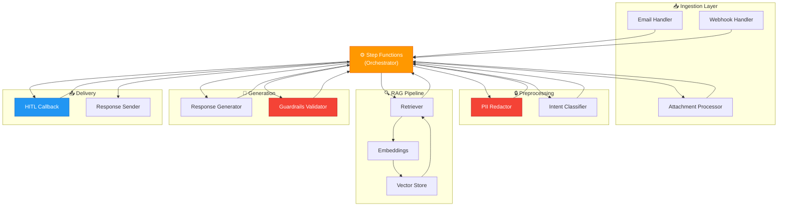

# System Design — Component Deep Dive

> **Purpose:** Detailed breakdown of every component in the Insurance AI Agent architecture.  
> Each section covers: what it does, why it exists, how it works internally, AWS services used, inputs/outputs, failure modes, and code references.

---

## Table of Contents

| #   | Component                                           | File(s)                   | AWS Services           |
| --- | --------------------------------------------------- | ------------------------- | ---------------------- |
| 1   | [Email Handler](#1-email-handler)                   | `email_handler.py`        | SES, SNS, S3, DynamoDB |
| 2   | [Webhook Handler](#2-webhook-handler)               | `webhook_handler.py`      | API Gateway, Lambda    |
| 3   | [Attachment Processor](#3-attachment-processor)     | `attachment_processor.py` | S3, Textract           |
| 4   | [PII Redactor](#4-pii-redactor)                     | `pii_redactor.py`         | Comprehend, SageMaker  |
| 5   | [Intent Classifier](#5-intent-classifier)           | `intent_classifier.py`    | Bedrock, SageMaker     |
| 6   | [RAG Embeddings](#6-rag-embeddings)                 | `embeddings.py`           | Bedrock Titan V2       |
| 7   | [Vector Store](#7-vector-store)                     | `vector_store.py`         | OpenSearch Serverless  |
| 8   | [RAG Retriever](#8-rag-retriever)                   | `retriever.py`            | OpenSearch, Bedrock    |
| 9   | [Response Generator](#9-response-generator)         | `generator.py`            | Bedrock Claude         |
| 10  | [Guardrails Validator](#10-guardrails-validator)    | `guardrails.py`           | Bedrock Guardrails     |
| 11  | [Orchestration Engine](#11-orchestration-engine)    | `state_machine.py`        | Step Functions         |
| 12  | [HITL Callback](#12-hitl-callback)                  | `hitl_callback.py`        | Step Functions, SQS    |
| 13  | [Response Sender](#13-response-sender)              | `response_sender.py`      | SES, S3                |
| 14  | [Review Dashboard](#14-review-dashboard)            | `dashboard/app.py`        | Streamlit, Cognito     |
| 15  | [Indexing Pipeline](#15-indexing-pipeline)          | `indexing_pipeline.py`    | S3, OpenSearch         |
| 16  | [CDK Infrastructure](#16-cdk-infrastructure-stacks) | `infra/stacks/`           | CloudFormation         |

---

## 1. Email Handler

### What It Does

The **entry point** for email-based customer support requests. Receives raw MIME emails from Amazon SES, parses them into a normalized ticket format, and publishes to the orchestration pipeline.

### Why It Exists

Emails are the primary channel for insurance support queries. This component decouples the email format (MIME, attachments, headers) from the internal ticket format used by all downstream components.

### Architecture

```
Amazon SES → SES Receipt Rule → SNS Topic → Lambda (email_handler)
                                                    ↓
                                              [Parse MIME]
                                              [Resolve Customer]
                                              [Extract Attachments → S3]
                                              [Save Ticket → DynamoDB]
                                              [Publish → SNS → Step Functions]
```

### How It Works Internally

| Step | Action                 | Detail                                                                                       |
| ---- | ---------------------- | -------------------------------------------------------------------------------------------- |
| 1    | **Receive SES event**  | SES stores raw email in S3, triggers SNS notification                                        |
| 2    | **Parse MIME**         | Uses Python `email` module to separate body text from attachments                            |
| 3    | **Upload attachments** | PDFs, images uploaded to `s3://insurance-ai-attachments/`                                    |
| 4    | **Resolve customer**   | Queries DynamoDB `CustomerProfiles` via `email-index` GSI; creates new customer if not found |
| 5    | **Create ticket**      | Generates UUID `ticket_id`, sets `status=received`, builds `NormalizedTicket`                |
| 6    | **Save raw event**     | Stores original SES notification as audit trail in S3                                        |
| 7    | **Persist ticket**     | Writes `NormalizedTicket` to DynamoDB Tickets table                                          |
| 8    | **Publish downstream** | SNS publish with channel and priority attributes                                             |

### Input / Output

```
Input:  SES notification (via SNS) → raw MIME email in S3
Output: NormalizedTicket JSON → SNS orchestration topic → Step Functions
```

### Key Code Reference

```python
# lambdas/ingestion/email_handler.py

def _process_ses_record(record: dict) -> NormalizedTicket:
    # Extract SES notification from SNS wrapper
    sns_message = json.loads(record["Sns"]["Message"])
    mail_meta = sns_message["mail"]
    message_id = mail_meta["messageId"]

    # Fetch and parse raw email from S3
    raw_obj = s3.get_object(Bucket=RAW_BUCKET, Key=f"incoming-emails/{message_id}")
    body_text, attachment_keys = _parse_mime_email(raw_obj["Body"].read(), message_id)

    # Build normalized ticket
    ticket = NormalizedTicket(
        channel=ChannelType.EMAIL,
        customer_id=_resolve_customer_id(mail_meta["source"]),
        message_body=body_text,
        attachments=attachment_keys,
        status=TicketStatus.RECEIVED,
    )
```

### AWS Services Used

| Service      | Purpose                              | Config                                 |
| ------------ | ------------------------------------ | -------------------------------------- |
| **SES**      | Receive emails                       | Receipt Rule + S3 Action               |
| **SNS**      | Fan-out trigger                      | Topic: `insurance-ai-ingestion`        |
| **S3**       | Raw email + attachments storage      | Buckets: `raw-messages`, `attachments` |
| **DynamoDB** | Ticket persistence + customer lookup | Tables: `Tickets`, `CustomerProfiles`  |
| **Lambda**   | Compute                              | 512MB, 30s timeout                     |

### Failure Modes

| Failure               | Impact                 | Mitigation                                              |
| --------------------- | ---------------------- | ------------------------------------------------------- |
| S3 raw email missing  | Can't parse email body | Fallback: extract from SNS notification `content` field |
| Customer lookup fails | Unknown customer       | Generate temporary `CUST-XXXXXXXX` ID                   |
| DynamoDB write fails  | Ticket lost            | Lambda retry (3 attempts) + DLQ                         |
| SNS publish fails     | Ticket not processed   | DLQ captures failed messages; manual replay             |

---

## 2. Webhook Handler

### What It Does

Handles incoming requests from **WhatsApp**, **web chat**, and other non-email channels via a REST API.

### Why It Exists

Modern customer support spans multiple channels. The webhook handler normalizes all non-email inputs into the same `NormalizedTicket` format as the email handler, ensuring the downstream pipeline is **channel-agnostic**.

### Architecture

```
API Gateway (REST) → Lambda (webhook_handler)
     │                        ↓
     │                  [Validate API Key]
     │                  [Parse JSON Body]
     │                  [Build NormalizedTicket]
     │                  [Save → DynamoDB]
     │                  [Publish → SNS]
     │
     └── Response: 202 Accepted + ticket_id
```

### Input / Output

```
Input:  POST /v1/tickets
        { "channel": "whatsapp", "customer_id": "...", "message": "..." }

Output: 202 Accepted
        { "ticket_id": "TKT-xxx", "status": "received" }
        + NormalizedTicket → SNS → Step Functions
```

### Key Difference from Email Handler

| Aspect       | Email Handler                 | Webhook Handler         |
| ------------ | ----------------------------- | ----------------------- |
| Trigger      | SES → SNS → Lambda            | API Gateway → Lambda    |
| Input format | Raw MIME email                | Structured JSON         |
| Attachments  | Extracted from MIME parts     | Pre-uploaded S3 URLs    |
| Customer ID  | Resolved from email address   | Provided by client      |
| Response     | Async (no response to caller) | Sync 202 + tracking URL |

---

## 3. Attachment Processor

### What It Does

Extracts text content from email attachments (PDFs, images, Word docs) to include in the ticket body for classification and RAG retrieval.

### Why It Exists

Insurance tickets frequently include supporting documents (claim forms, medical bills, policy documents). Without processing attachments, the system would miss critical context needed for accurate classification and response generation.

### How It Works

```
S3 (attachment file) → Lambda → Amazon Textract (if PDF/image)
                                        ↓
                                  Extracted Text
                                        ↓
                              Appended to ticket body
```

| File Type        | Processing Method      | Tool                    |
| ---------------- | ---------------------- | ----------------------- |
| PDF (text)       | Direct text extraction | `pdfplumber` / `PyPDF2` |
| PDF (scanned)    | OCR                    | Amazon Textract         |
| Image (JPEG/PNG) | OCR                    | Amazon Textract         |
| Word (.docx)     | XML parsing            | `python-docx`           |
| Unsupported      | Flagged for HITL       | Manual review           |

### Limits & Safety

| Constraint    | Value                | Reason                         |
| ------------- | -------------------- | ------------------------------ |
| Max file size | 10 MB                | Textract limit / cost control  |
| Max pages     | 50                   | Processing time limit          |
| Allowed types | PDF, JPEG, PNG, DOCX | Security — no executables      |
| Timeout       | 120s                 | OCR can be slow for large PDFs |

---

## 4. PII Redactor

### What It Does

The **most critical safety component**. Detects and masks Personally Identifiable Information (PII) in customer messages BEFORE any data reaches the LLM. Produces a reversible mapping so PII can be restored in the final response.

### Why It Exists

**Regulatory requirement:** Insurance companies handle sensitive data (SSN, medical info, financial details). Sending PII to an external LLM (even within AWS) creates compliance risk. The redactor ensures **zero PII exposure** to the language model.

### Three-Layer Detection Pipeline

```
Raw Message
    ↓
[Layer 1: Amazon Comprehend]  ← Standard PII (SSN, CC, DOB, NAME, ADDRESS)
    ↓
[Layer 2: Custom Regex]       ← Insurance-specific (POL-*, CLM-*, policy numbers)
    ↓
[Layer 3: SageMaker NER]      ← Fine-tuned model for domain PII (optional)
    ↓
Redacted Message + PII Mapping
```

### How Redaction Works

```
Input:   "My SSN is 123-45-6789 and policy POL-202456"
Output:  "My SSN is [SSN_0] and policy [POLICY_NUMBER_1]"
Mapping: {"[SSN_0]": "123-45-6789", "[POLICY_NUMBER_1]": "POL-202456"}
```

**Why placeholders instead of removal:**

- LLM still understands the sentence structure
- LLM knows a policy number exists (helpful for RAG retrieval)
- PII can be restored in the final response

### Key Code — Regex Patterns

```python
# lambdas/preprocessing/pii_redactor.py

INSURANCE_PII_PATTERNS = {
    "POLICY_NUMBER": re.compile(r"\b(?:POL|INS|PLY)[-/]?\d{6,12}\b", re.IGNORECASE),
    "CLAIM_NUMBER":  re.compile(r"\b(?:CLM|CLAIM)[-/]?\d{6,12}\b", re.IGNORECASE),
    "SSN":           re.compile(r"\b\d{3}-\d{2}-\d{4}\b"),
    "CREDIT_CARD":   re.compile(r"\b\d{4}[\s-]?\d{4}[\s-]?\d{4}[\s-]?\d{4}\b"),
    "PHONE":         re.compile(r"\b(?:\+1[-.\\s]?)?\(?\d{3}\)?[-.\\s]?\d{3}[-.\\s]?\d{4}\b"),
    "EMAIL":         re.compile(r"\b[A-Za-z0-9._%+-]+@[A-Za-z0-9.-]+\.[A-Z|a-z]{2,}\b"),
    "DATE_OF_BIRTH": re.compile(r"\b(?:DOB|Date of Birth)[:\s]*\d{1,2}[/\-]\d{1,2}[/\-]\d{2,4}\b"),
}
```

### Key Code — PII Restoration (Post-Approval)

```python
def restore_pii(text: str, pii_mapping: dict[str, str]) -> str:
    """Called AFTER human review, before sending to customer."""
    restored = text
    for placeholder, original in pii_mapping.items():
        restored = restored.replace(placeholder, original)
    return restored
```

### AWS Services

| Service        | Purpose                                                        |
| -------------- | -------------------------------------------------------------- |
| **Comprehend** | Standard PII detection (NAME, SSN, CC, ADDRESS, DOB)           |
| **SageMaker**  | Custom NER endpoint for insurance-specific entities (optional) |
| **KMS**        | Encrypts PII mapping at rest in DynamoDB                       |

### Failure Modes

| Failure              | Impact             | Mitigation                                       |
| -------------------- | ------------------ | ------------------------------------------------ |
| Comprehend API error | PII leaks to LLM   | Fallback to SageMaker → regex-only → force HITL  |
| Regex miss           | Domain PII leaks   | Bedrock Guardrails (Layer 3) as final safety net |
| Large text (>100KB)  | Comprehend rejects | Auto-chunking into 90KB segments                 |

---

## 5. Intent Classifier

### What It Does

Categorizes the customer's query into one of 4 intent types and determines whether the ticket requires mandatory human review.

### Intent Types

| Intent                 | Description                        | Auto-Approve?               | Example                       |
| ---------------------- | ---------------------------------- | --------------------------- | ----------------------------- |
| `GENERAL_INQUIRY`      | Policy info, coverage questions    | ✅ Yes (if ≥90% confidence) | "What's my deductible?"       |
| `POLICY_CHANGE`        | Address change, beneficiary update | ❌ HITL                     | "Update my address"           |
| `CLAIM_ISSUE`          | Claim status, denial dispute       | ❌ Always HITL              | "My claim was denied"         |
| `COMPLAINT_MISSELLING` | Product complaint, misselling      | ❌ Always HITL              | "I was sold the wrong policy" |

### Two Classification Backends

| Backend            | Method                          | When Used                    |
| ------------------ | ------------------------------- | ---------------------------- |
| **Bedrock Claude** | Zero-shot prompt classification | Default — no training needed |
| **SageMaker**      | Fine-tuned BERT/DistilBERT      | Production — higher accuracy |

### Escalation Keywords

The classifier applies **keyword-based override rules** that force HITL review regardless of the model's classification:

```python
ESCALATION_KEYWORDS = [
    "lawyer", "attorney", "legal action", "sue",
    "fraud", "scam", "regulator", "ombudsman",
    "media", "press", "social media", "news",
    "discrimination", "harassment",
    "death", "deceased", "fatal",
]
```

If any keyword is found → `force_hitl = True` + intent overridden to `COMPLAINT_MISSELLING`.

### Classification Flow

```
Redacted Message
    ↓
[Bedrock Claude / SageMaker]  → { intent, confidence, reasoning }
    ↓
[Escalation Keyword Check]     → override if keywords found
    ↓
[HITL Decision Logic]
    ├── Complaint/Claim → force_hitl = True
    ├── Confidence < 90% → force_hitl = True
    ├── Escalation keyword → force_hitl = True
    └── General + high confidence → force_hitl = False (auto-path)
```

### Input / Output

```python
# Input
{"message_body_redacted": "What is my deductible for dental?"}

# Output (added to ticket)
{
  "classification": {
    "intent": "GENERAL_INQUIRY",
    "confidence": 0.94,
    "reasoning": "Customer asking about coverage details",
    "force_hitl": False,
    "escalation_triggered": False
  }
}
```

---

## 6. RAG Embeddings

### What It Does

Converts text (queries and documents) into 1024-dimensional vector representations using Amazon Bedrock Titan Text Embeddings V2.

### Why Titan V2?

| Factor             | Titan V2 (Chosen)       | OpenAI ada-002    | Cohere Embed      |
| ------------------ | ----------------------- | ----------------- | ----------------- |
| **Data residency** | Stays in AWS VPC        | Leaves AWS ❌     | Leaves AWS ❌     |
| **Dimensions**     | Configurable (256-1024) | Fixed 1536        | Fixed 1024        |
| **Cost**           | $0.0001/1K tokens       | $0.0001/1K tokens | $0.0001/1K tokens |
| **HIPAA eligible** | ✅                      | ❌                | ❌                |
| **Normalization**  | Built-in                | Manual            | Manual            |

### How It Works

```python
class BedrockEmbeddings:
    def __init__(self):
        self.model_id = "amazon.titan-embed-text-v2:0"
        self.dimension = 1024  # configurable

    def embed_query(self, text: str) -> list[float]:
        body = {
            "inputText": text,
            "dimensions": self.dimension,
            "normalize": True,  # Unit vector for cosine similarity
        }
        response = bedrock_runtime.invoke_model(modelId=self.model_id, body=json.dumps(body))
        return json.loads(response["body"].read())["embedding"]
```

### Usage in Pipeline

| Stage                  | Method                   | Volume                      |
| ---------------------- | ------------------------ | --------------------------- |
| **Indexing** (offline) | `embed_documents(texts)` | Batch: thousands of chunks  |
| **Query** (online)     | `embed_query(text)`      | Single: 1 query per request |

---

## 7. Vector Store

### What It Does

Manages the connection to **Amazon OpenSearch Serverless** and performs k-NN (k-Nearest Neighbor) vector similarity searches across three indices.

### Three Indices

| Index Name           | Content                         | Typical Size | Updated           |
| -------------------- | ------------------------------- | ------------ | ----------------- |
| `insurance-policies` | Policy document chunks          | ~50K chunks  | Weekly batch      |
| `historical-tickets` | Past resolved tickets           | ~100K chunks | Daily incremental |
| `compliance-rules`   | Regulatory rules, product terms | ~5K chunks   | Monthly batch     |

### Search Method

```
Query Vector (1024-dim)
    ↓
OpenSearch k-NN plugin (HNSW algorithm)
    ↓
Top-K results with cosine similarity scores
    ↓
[SearchResult(content, source, doc_type, section, score)]
```

**HNSW (Hierarchical Navigable Small World)** is the default k-NN algorithm in OpenSearch. It provides:

- Sub-100ms search latency even at millions of vectors
- Approximate nearest neighbor (ANN) — trades tiny accuracy for massive speed
- No cold start needed for queries

### OpenSearch Serverless Config

| Setting    | Value                    | Rationale                    |
| ---------- | ------------------------ | ---------------------------- |
| **Type**   | Vector Search collection | Optimized for k-NN           |
| **OCU**    | 2 minimum (auto-scales)  | Cost-performance balance     |
| **Engine** | `nmslib` with HNSW       | Fastest for 1024-dim vectors |
| **Access** | VPC Endpoint only        | No public internet access    |

---

## 8. RAG Retriever

### What It Does

The **orchestrator** of the RAG pipeline. Takes a customer query, generates an embedding, searches the vector store, applies the similarity threshold (strict mode), deduplicates results, and assembles the context for the LLM.

### Why It's Separate from Vector Store

**Separation of concerns:**

- `VectorStore` handles low-level OpenSearch APIs
- `Retriever` handles business logic: strict mode, deduplication, context assembly

### Strict Mode — The Critical Safety Feature

```python
# rag/retriever.py

max_score = max(r.score for r in results)
threshold = 0.7  # settings.opensearch.similarity_threshold

if self.strict_mode and max_score < threshold:
    return RetrievalContext(
        has_sufficient_context=False,  # Tells generator to escalate
        max_similarity_score=max_score,
    )
```

**What happens when strict mode triggers:**

1. Retriever returns `has_sufficient_context = False`
2. Generator produces a safe template: _"Let me connect you with a specialist..."_
3. Ticket routes to HITL review
4. Customer gets an accurate (if delayed) response from a human

### Full Retrieval Flow

```
Customer Query (redacted)
    ↓
[1. embed_query()] ──→ 1024-dim vector
    ↓
[2. search_all_indices()] ──→ Top-K results from 3 indices
    ↓
[3. Similarity Threshold] ──→ ≥0.7? Continue : Insufficient context
    ↓
[4. Deduplicate] ──→ Remove near-identical chunks (content hash)
    ↓
[5. Assemble Context] ──→ RetrievalContext with formatted chunks
    ↓
Ready for LLM prompt injection
```

### Output Format

```python
RetrievalContext(
    chunks=[
        {"content": "...", "source": "auto-policy-v3.pdf", "doc_type": "policies", "score": 0.89},
        {"content": "...", "source": "dental-rider.pdf", "doc_type": "policies", "score": 0.82},
    ],
    has_sufficient_context=True,
    max_similarity_score=0.89,
    total_chunks_searched=152,
    indices_searched=["insurance-policies", "compliance-rules"],
)
```

---

## 9. Response Generator

### What It Does

Constructs the LLM prompt using RAG context and customer query, invokes Amazon Bedrock Claude 4.6 Sonnet, and parses the structured response.

### Why Claude 4.6 Sonnet?

| Factor                | Claude 4.6 Sonnet | GPT-4o           | Llama 3           |
| --------------------- | ----------------- | ---------------- | ----------------- |
| **AWS native**        | ✅ Bedrock        | ❌ External API  | ✅ SageMaker      |
| **HIPAA eligible**    | ✅                | ❌               | ✅ (self-hosted)  |
| **Data stays in VPC** | ✅                | ❌               | ✅                |
| **Structured output** | Excellent         | Excellent        | Good              |
| **Cost**              | $0.003/1K tokens  | $0.005/1K tokens | Free (infra cost) |

### Prompt Architecture

```
┌─────────────────────────────────────────┐
│ SYSTEM PROMPT                           │
│ "You are an insurance customer support  │
│  agent. Rules: only use provided docs,  │
│  never make financial promises..."      │
├─────────────────────────────────────────┤
│ USER PROMPT (Jinja2 template)           │
│                                         │
│ ## Retrieved Context                    │
│ Context 1 — auto-policy-v3.pdf          │
│ "The dental deductible is $500..."      │
│                                         │
│ Context 2 — dental-rider.pdf            │
│ "Vision coverage includes..."           │
│                                         │
│ ## Customer Query                       │
│ Channel: email                          │
│ "What is my deductible for dental?"     │
│                                         │
│ ## Instructions                         │
│ Respond in JSON: {draft_response,       │
│   confidence, cited_sections,           │
│   requires_escalation}                  │
└─────────────────────────────────────────┘
```

### Insufficient Context Handling

When RAG returns `has_sufficient_context=False`, the generator **does NOT call the LLM**. Instead, it returns a pre-defined safe response:

```python
def _insufficient_context_response(self, ticket_id, context):
    return DraftResponse(
        draft_text="Thank you for reaching out. I want to make sure I give you "
                   "accurate information. Let me connect you with a specialist...",
        confidence=0.0,
        requires_escalation=True,
        escalation_reason=f"Insufficient RAG context (max_score={context.max_similarity_score:.3f})",
    )
```

### Output Format

```python
DraftResponse(
    ticket_id="TKT-abc123",
    draft_text="Based on your auto insurance policy (Section 4.2), your dental deductible is $500 per year...",
    cited_sections=["auto-policy-v3.pdf § 4.2", "dental-rider.pdf § 1.1"],
    confidence=0.88,
    requires_escalation=False,
    context_chunks_used=3,
    is_grounded=True,
)
```

---

## 10. Guardrails Validator

### What It Does

The **5-layer safety net** that validates both inputs (before LLM) and outputs (after LLM) to prevent harmful, incorrect, or policy-violating responses.

### 5 Validation Layers

| Layer  | Type   | What It Catches                             | Method                             |
| ------ | ------ | ------------------------------------------- | ---------------------------------- |
| **L1** | Input  | Toxicity, threats, manipulation             | Bedrock Guardrails API             |
| **L2** | Output | PII in response, hate speech                | Bedrock Guardrails API             |
| **L3** | Output | Payout promises                             | Regex keyword matching             |
| **L4** | Output | Off-topic (medical/legal/investment advice) | Regex keyword matching             |
| **L5** | Output | Hallucination                               | LLM-as-judge (second Bedrock call) |

### Layer 3 — Payout Promise Detection

```python
PAYOUT_KEYWORDS = [
    "approved for", "will pay", "payment of $", "refund of $",
    "covered amount", "settlement of", "authorize payment",
    "claim approved", "reimbursement of $", "pay you",
]

def _check_payout_promises(self, text: str) -> list[str]:
    text_lower = text.lower()
    violations = []
    for keyword in PAYOUT_KEYWORDS:
        if keyword in text_lower:
            violations.append(f"PAYOUT_PROMISE: '{keyword}' detected")
    return violations
```

### Layer 5 — Hallucination Check (LLM-as-Judge)

```python
def _check_hallucination(self, response_text, context_chunks):
    prompt = f"""
    You are a fact-checker. Compare the RESPONSE against SOURCE DOCUMENTS.

    RESPONSE: {response_text}
    SOURCE DOCUMENTS: {format_chunks(context_chunks)}

    For each claim:
    1. Is it directly supported by SOURCE DOCUMENTS?
    2. If neither supported nor a reasonable inference → HALLUCINATION

    Output: {{"hallucinated": true/false, "ungrounded_claims": [...]}}
    """
    result = bedrock.invoke(prompt)
    return result["hallucinated"]
```

### Validation Flow

```
Input Text
    ↓
[L1: Input Toxicity Check]  →  Block if toxic
    ↓
[LLM generates response]
    ↓
[L2: Bedrock Guardrails]    →  Block if PII/harmful
    ↓
[L3: Payout Promise Check]  →  Block if financial commitment
    ↓
[L4: Off-Topic Check]       →  Block if out-of-scope advice
    ↓
[L5: Hallucination Check]   →  Block if ungrounded claims
    ↓
✅ All passed → Response approved for routing
```

### Output — GuardrailResult

```python
GuardrailResult(
    passed=False,
    violations=["PAYOUT_PROMISE: 'approved for' detected"],
    payout_promise_detected=True,
    severity="high",
    should_block=True,  # Forces HITL review
)
```

---

## 11. Orchestration Engine

### What It Does

Defines the **AWS Step Functions state machine** that orchestrates the entire ticket processing pipeline. Controls the flow, error handling, retries, timeouts, and HITL branching.

### State Machine Flow

```
StartAt: ProcessAttachments
    ↓
ProcessAttachments → RedactPII → ClassifyIntent
    ↓
[Choice: ForceHITL?]
    ├── Yes → SendToHITLQueue (waitForTaskToken) → Resume
    └── No  → RetrieveContext → GenerateResponse → ValidateResponse
                                                        ↓
                                              [Choice: AutoApprove?]
                                                ├── Yes → SendResponse
                                                └── No  → SendToHITLQueue → Resume → SendResponse
    ↓
StoreAuditLog → ✅ Success
```

### Key State Machine Features

| Feature         | Implementation                                           | Why                                                   |
| --------------- | -------------------------------------------------------- | ----------------------------------------------------- |
| **HITL Pause**  | `waitForTaskToken` resource type                         | Pauses execution for up to 24h with zero compute cost |
| **Retries**     | `IntervalSeconds: 2, MaxAttempts: 3, BackoffRate: 2.0`   | Handles transient Lambda/Bedrock failures             |
| **Catch-all**   | Routes to `HandleError` state on any unhandled exception | No ticket silently lost                               |
| **Timeouts**    | Per-state: 60s for Lambda, 86400s (24h) for HITL wait    | Prevents infinite hangs                               |
| **DLQ routing** | Failed executions → SQS DLQ                              | Ops team can investigate and replay                   |

### State Machine Definition

```python
# orchestration/state_machine.py

def build_state_machine_definition(
    pii_lambda_arn, classifier_lambda_arn, attachment_lambda_arn,
    rag_lambda_arn, generator_lambda_arn, validator_lambda_arn,
    response_sender_lambda_arn, feedback_lambda_arn,
    hitl_queue_url, dlq_arn,
) -> dict:
    """Build the complete ASL (Amazon States Language) definition."""

    return {
        "StartAt": "ProcessAttachments",
        "States": {
            "ProcessAttachments": { "Type": "Task", "Resource": attachment_lambda_arn, ... },
            "RedactPII":          { "Type": "Task", "Resource": pii_lambda_arn, ... },
            "ClassifyIntent":     { "Type": "Task", "Resource": classifier_lambda_arn, ... },
            "CheckForceHITL":     { "Type": "Choice", ... },
            "SendToHITLQueue":    { "Type": "Task", "Resource": "arn:aws:states:::sqs:sendMessage.waitForTaskToken", ... },
            "RetrieveContext":    { "Type": "Task", "Resource": rag_lambda_arn, ... },
            "GenerateResponse":   { "Type": "Task", "Resource": generator_lambda_arn, ... },
            "ValidateResponse":   { "Type": "Task", "Resource": validator_lambda_arn, ... },
            "SendResponse":       { "Type": "Task", "Resource": response_sender_lambda_arn, ... },
            "StoreAuditLog":      { "Type": "Task", "Resource": feedback_lambda_arn, ... },
        }
    }
```

---

## 12. HITL Callback

### What It Does

Processes human reviewer decisions (approve / edit / reject / escalate) from the Streamlit dashboard and sends callbacks to Step Functions to **resume the paused workflow**.

### How the Callback Pattern Works

```
Step Functions                 SQS HITL Queue              Dashboard
     │                              │                         │
     │── waitForTaskToken ─────────▶│                         │
     │   (execution PAUSES)         │                         │
     │                              │── ReceiveMessage ──────▶│
     │                              │   {ticket, task_token}  │
     │                              │                         │── Human reviews
     │                              │                         │
     │◀── send_task_success ────────│◀── POST /callback ──────│
     │    (execution RESUMES)       │    {task_token, decision}│
     │                              │                         │
     ▼                              │                         │
  Continue pipeline                 │                         │
```

### Decision Types

| Decision      | Action                   | Step Functions Call                                     |
| ------------- | ------------------------ | ------------------------------------------------------- |
| **Approved**  | Use AI draft as-is       | `sfn.send_task_success(token, original_draft)`          |
| **Edited**    | Use human-edited version | `sfn.send_task_success(token, edited_draft)`            |
| **Rejected**  | Discard draft entirely   | `sfn.send_task_failure(token, "ReviewRejected")`        |
| **Escalated** | Route to specialist team | `sfn.send_task_failure(token, "EscalatedToSpecialist")` |

---

## 13. Response Sender

### What It Does

The **final mile** of the pipeline. Restores PII in the approved response, sends it to the customer via the original channel, updates the ticket to `resolved`, and writes an immutable audit log to S3.

### Pipeline Steps

```
Approved Response (with placeholders)
    ↓
[1. Restore PII]       →  "[POLICY_NUMBER_0]" → "POL-202456"
    ↓
[2. Send via Channel]
    ├── Email → SES (HTML + plain text)
    ├── WhatsApp → (future: callback to WhatsApp API)
    └── Chat → (future: push to WebSocket)
    ↓
[3. Update DynamoDB]    →  status = "resolved", response_text = ...
    ↓
[4. Store Audit Log]    →  S3 with KMS encryption + Object Lock
```

### Audit Log Record

```json
{
  "ticket_id": "TKT-abc123",
  "customer_id": "CUST-12345",
  "channel": "email",
  "original_query": "My SSN is 123-45-6789...",
  "redacted_query": "My SSN is [SSN_0]...",
  "ai_draft": "Based on your policy...",
  "final_response": "Based on your policy POL-202456...",
  "confidence": 0.88,
  "approved_by": "agent-jane-doe",
  "cited_sections": ["auto-policy-v3.pdf § 4.2"],
  "pii_detected": 3,
  "classification": { "intent": "GENERAL_INQUIRY", "confidence": 0.94 }
}
```

**The audit log captures the complete lifecycle** — from original (with PII) to redacted (sent to LLM) to final (PII restored). This enables:

- Compliance auditing
- Model performance analysis
- Training data collection (for DPO fine-tuning)

---

## 14. Review Dashboard

### What It Does

A **Streamlit web application** where human agents review AI-generated drafts, inspect ticket details, and make approval decisions for tickets routed to HITL review.

### Architecture

```
Browser → Streamlit App → Cognito Auth → API Gateway → HITL Callback Lambda
                                ↓
                         DynamoDB (read tickets)
                         SQS (read HITL queue)
```

### Dashboard Features

| Feature           | Description                                                           |
| ----------------- | --------------------------------------------------------------------- |
| **Review Queue**  | Lists all tickets with `status=awaiting_review`, sorted by priority   |
| **Ticket Detail** | Shows redacted message, classification, confidence, escalation reason |
| **AI Draft**      | Displays the generated response with cited sources                    |
| **Actions**       | Approve, Edit (inline editor), Reject (with notes), Escalate          |
| **Auth**          | Cognito MFA with RBAC (reviewer, admin, read-only)                    |
| **Metrics**       | Review time, approval rate, tickets per agent                         |

### RBAC Groups

| Cognito Group | Permissions                                              |
| ------------- | -------------------------------------------------------- |
| `reviewers`   | View queue, approve/edit/reject tickets                  |
| `admins`      | All reviewer permissions + delete tickets, manage agents |
| `read-only`   | View queue and ticket details (no actions)               |

---

## 15. Indexing Pipeline

### What It Does

Processes insurance policy documents, FAQs, and historical tickets into searchable vector embeddings stored in OpenSearch Serverless.

### Pipeline Flow

```
S3 (raw documents)
    ↓
[1. Load Documents]    →  PDF, DOCX, Markdown, JSON
    ↓
[2. Chunk]             →  1000-char segments, 200-char overlap
    ↓
[3. Enrich Metadata]   →  doc_type, source, section, page_number
    ↓
[4. Embed]             →  Titan V2 (1024-dim vectors)
    ↓
[5. Index]             →  OpenSearch Serverless (k-NN)
```

### Chunking Strategy

| Parameter      | Value                     | Rationale                                            |
| -------------- | ------------------------- | ---------------------------------------------------- |
| **Chunk size** | 1000 characters           | Large enough for context, small enough for precision |
| **Overlap**    | 200 characters            | Prevents information loss at chunk boundaries        |
| **Separator**  | `\n\n` (paragraphs first) | Preserves semantic boundaries in documents           |

### Why Overlap Matters

```
Document: "...deductible is $500. Coverage includes dental, vision, and hearing.
           Additional riders can be purchased separately..."

Without overlap:
  Chunk 1: "...deductible is $500. Coverage includes dental, vision,"
  Chunk 2: "and hearing. Additional riders can be purchased..."
  → Query "does coverage include hearing?" might miss Chunk 1 context

With 200-char overlap:
  Chunk 1: "...deductible is $500. Coverage includes dental, vision, and hearing."
  Chunk 2: "dental, vision, and hearing. Additional riders can be purchased..."
  → Both chunks contain "hearing" with surrounding context ✅
```

### Document Types Indexed

| Index                | Source          | Documents                                     | Update Frequency |
| -------------------- | --------------- | --------------------------------------------- | ---------------- |
| `insurance-policies` | S3: `policies/` | Auto, Home, Health, Life policy PDFs          | Weekly           |
| `historical-tickets` | DynamoDB export | Past resolved tickets with approved responses | Daily            |
| `compliance-rules`   | S3: `rules/`    | Regulatory guidelines, product terms          | Monthly          |

---

## 16. CDK Infrastructure Stacks

### What It Does

Defines all AWS infrastructure as code using **AWS CDK (Python)**. The infrastructure is split into 7 independent stacks with explicit dependency ordering.

### Stack Dependency Graph

```
NetworkStack ──→ SecurityStack ──→ StorageStack ──→ SearchStack
                                        │               │
                                        ▼               ▼
                                   IngestionStack  MLStack
                                        │               │
                                        └───────┬───────┘
                                                ▼
                                       OrchestrationStack
```

### Stack Breakdown

| Stack                  | Resources Created                                                     | Key Config                                                        |
| ---------------------- | --------------------------------------------------------------------- | ----------------------------------------------------------------- |
| **NetworkStack**       | VPC (2 AZs), Private subnets, NAT Gateway, 8 VPC Endpoints            | Endpoints: S3, DDB, SES, Bedrock, SFN, Comprehend, SageMaker, SQS |
| **SecurityStack**      | KMS CMK, Cognito User Pool, IAM roles                                 | Key rotation: annual, MFA: required                               |
| **StorageStack**       | S3 buckets (raw, attachments, audit), DynamoDB tables (3), SQS queues | S3: Object Lock on audit, DDB: On-Demand billing                  |
| **SearchStack**        | OpenSearch Serverless collection, Security policy, VPC endpoint       | Collection type: VECTORSEARCH                                     |
| **IngestionStack**     | 3 Lambda functions (email, webhook, attachment), SNS topics           | Memory: 512MB, Timeout: 120s                                      |
| **MLStack**            | SageMaker endpoints (NER, classifier), Bedrock guardrail configs      | Serverless inference                                              |
| **OrchestrationStack** | Step Functions state machine, HITL SQS queue, all pipeline Lambdas    | Standard workflow, DLQ                                            |

### Per-Lambda IAM (Least Privilege)

| Lambda               | Can Access                                                 | Cannot Access            |
| -------------------- | ---------------------------------------------------------- | ------------------------ |
| Email Handler        | S3 (read/write), DynamoDB (write), SNS (publish)           | Bedrock, Comprehend, SES |
| PII Redactor         | Comprehend (detect), SageMaker (invoke), DynamoDB (update) | S3, SES, Bedrock         |
| Intent Classifier    | Bedrock (invoke), SageMaker (invoke)                       | S3, SES, Comprehend      |
| RAG Retriever        | OpenSearch (read), Bedrock Titan (invoke)                  | S3, DynamoDB, SES        |
| Response Generator   | Bedrock Claude (invoke)                                    | S3, DynamoDB, SES        |
| Guardrails Validator | Bedrock (invoke, guardrails)                               | S3, DynamoDB, SES        |
| Response Sender      | SES (send), DynamoDB (update), S3 (write audit)            | Bedrock, Comprehend      |
| HITL Callback        | Step Functions (callback), DynamoDB (update)               | S3, SES, Bedrock         |

---

## Component Interaction Summary



---

> **Total Components:** 16 | **Lambda Functions:** 8 | **AWS Services:** 15 | **Lines of Application Code:** ~2,500
