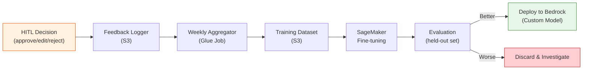

# System Design Interview — Insurance AI Agent

> **Purpose:** Comprehensive Q&A guide for system design interviews based on this project's architecture.
> **Difficulty Levels:** 🟢 Basic · 🟡 Intermediate · 🔴 Advanced

---

## Table of Contents

| #   | Section                                                          | Questions                                 |
| --- | ---------------------------------------------------------------- | ----------------------------------------- |
| 1   | [High-Level Design](#1-high-level-design)                        | Architecture, components, trade-offs      |
| 2   | [Data Modeling](#2-data-modeling)                                | DynamoDB, schema design, access patterns  |
| 3   | [RAG & Search](#3-rag--vector-search)                            | Embeddings, retrieval, relevance          |
| 4   | [Security & PII](#4-security--pii-handling)                      | Encryption, PII redaction, compliance     |
| 5   | [Orchestration](#5-orchestration--step-functions)                | Workflow, HITL, error handling            |
| 6   | [Scalability](#6-scalability--performance)                       | Throughput, latency, caching              |
| 7   | [LLM & Guardrails](#7-llm--guardrails)                           | Prompt engineering, safety, hallucination |
| 8   | [Cost & Operations](#8-cost--operations)                         | Optimization, monitoring, DR              |
| 9   | [Deep Dive Scenarios](#9-deep-dive-scenarios)                    | End-to-end walkthroughs                   |
| 10  | [API Design & Contracts](#10-api-design--contracts)              | REST, idempotency, versioning             |
| 11  | [Consistency & CAP Theorem](#11-consistency--cap-theorem)        | Eventual consistency, data integrity      |
| 12  | [Infrastructure as Code](#12-infrastructure-as-code)             | CDK stacks, deployment, rollback          |
| 13  | [Data Migration & Versioning](#13-data-migration--versioning)    | Schema evolution, zero-downtime           |
| 14  | [System Evolution & Future](#14-system-evolution--future-design) | Multi-region, real-time, A/B testing      |
| 15  | [Behavioral & Follow-ups](#15-behavioral--follow-up-questions)   | Why decisions, failures, team dynamics    |

---

## 1. High-Level Design

### 🟢 Q1: Walk me through the system architecture at a high level.

**Answer:**

The system is a **7-layer pipeline** that processes insurance customer support tickets end-to-end:

```
Customer Channels → Ingestion → PII Redaction → Intent Classification
    → RAG Retrieval → Response Generation → Guardrails → Approval → Output
```

**Key flow:**

1. **Ingestion Layer** — Emails arrive via Amazon SES, chat/WhatsApp via API Gateway. Each triggers a Lambda that normalizes the input into a structured ticket and stores attachments in S3.
2. **PII Redaction** — Amazon Comprehend + regex patterns detect and replace sensitive data (SSN, credit cards, policy numbers) with placeholders like `[SSN_0]`. The real values are stored in an encrypted PII mapping in DynamoDB.
3. **Intent Classification** — Amazon Bedrock classifies the ticket into categories (`general_inquiry`, `claim_status`, `complaint`). Escalation keywords (e.g., "lawyer", "fraud") trigger immediate human routing.
4. **RAG Retrieval** — The redacted query is embedded using Titan V2 (1024-dim), and OpenSearch Serverless performs k-NN vector search across 3 indices (policies, historical tickets, compliance rules).
5. **Response Generation** — Claude 4.6 Sonnet generates a grounded response using the retrieved context, with strict instructions to only use information from the provided documents.
6. **5-Layer Guardrails** — Validates the response for toxicity, payout promises, off-topic content, and hallucination.
7. **Approval Gateway** — General inquiries with ≥90% confidence get auto-approved. Claims/complaints always go to Human-in-the-Loop (HITL) review via a Streamlit dashboard.
8. **Output** — PII placeholders are restored, the response is sent via SES, and an immutable audit log is written to S3 with Object Lock.

**Why this matters:** This design ensures **zero PII exposure to the LLM**, **auditability at every step**, and **mandatory human oversight for financial decisions**.

---

### 🟢 Q2: Why did you choose a pipeline architecture over a microservices or event-driven approach?

**Answer:**

| Factor             | Pipeline (Chosen)          | Event-Driven               | Microservices           |
| ------------------ | -------------------------- | -------------------------- | ----------------------- |
| **Ordering**       | Guaranteed sequential      | Eventual consistency       | No ordering guarantee   |
| **Debugging**      | Visual Step Functions log  | Distributed tracing needed | Complex tracing         |
| **HITL**           | Native Task Token pause    | Custom SQS polling         | Separate service needed |
| **Audit**          | Built-in execution history | Must aggregate events      | Must aggregate logs     |
| **Error Handling** | Built-in retry + catch     | Dead letter queues         | Circuit breakers        |

The **pipeline wins** here because:

1. **Regulatory compliance** demands a clear, auditable processing order for every ticket.
2. **Step Functions** gives us visual debugging — you can see exactly where a ticket got stuck.
3. The **HITL pattern** requires pausing mid-workflow for up to 24 hours, which Step Functions handles natively via Task Tokens.

**Trade-off acknowledged:** The pipeline is less flexible for parallel processing. If we needed to process multiple independent enrichments simultaneously (e.g., sentiment analysis + entity extraction), we'd use Step Functions Parallel states.

---

### 🟡 Q3: How would you handle a 10x traffic spike?

**Answer:**

**Auto-scaling components (no changes needed):**

- **Lambda** — Scales automatically up to 1000 concurrent executions (configurable to 10,000 with quota increase).
- **DynamoDB** — On-Demand billing auto-scales to any throughput.
- **OpenSearch Serverless** — Auto-scales OCUs (OpenSearch Compute Units) based on load.
- **Step Functions Standard** — Unlimited state transitions per second.
- **SQS** — Virtually unlimited throughput.

**Bottleneck: Amazon Bedrock rate limits:**

| Model             | Default Limit | 10x Need | Mitigation             |
| ----------------- | ------------- | -------- | ---------------------- |
| Claude 4.6 Sonnet | 100 RPM       | 500 RPM  | Request quota increase |
| Titan Embeddings  | 1000 RPM      | 2000 RPM | Batch embedding API    |

**Mitigation strategies:**

1. **Caching** — Cache embeddings for duplicate queries using DynamoDB. Cache common question-answer pairs to skip LLM entirely.
2. **Batching** — Titan Embeddings supports batch API — group multiple queries into one call.
3. **Quota increase** — Pre-request Bedrock quota increases via AWS Support.
4. **Degradation** — If Bedrock is throttled, route to HITL instead of failing. The customer still gets a response, just with human delay.

---

### 🔴 Q4: What are the single points of failure (SPOF) and how do you mitigate them?

**Answer:**

| Component           | SPOF Risk           | Mitigation                                                                      |
| ------------------- | ------------------- | ------------------------------------------------------------------------------- |
| **VPC NAT Gateway** | Single AZ failure   | Deploy NAT in each AZ (Multi-AZ VPC)                                            |
| **OpenSearch**      | Cluster unavailable | Serverless auto-replicates; fallback to HITL if search fails                    |
| **Bedrock**         | Service outage      | Retry with backoff; fallback to "I'll need to check with a specialist" template |
| **Step Functions**  | Service outage      | AWS SLA 99.9%; DLQ captures failed executions for replay                        |
| **KMS**             | Key unavailable     | Multi-region key; cache data keys locally                                       |
| **SES**             | Sending throttle    | Pre-warm domain; secondary SES region failover                                  |

**Critical insight:** The system is designed so that **any AI/ML failure gracefully degrades to human handling**. If Bedrock, OpenSearch, or Comprehend goes down, the ticket routes to HITL review — the customer still gets a response, just slower.

---

## 2. Data Modeling

### 🟢 Q5: Why DynamoDB over a relational database like RDS PostgreSQL?

**Answer:**

| Factor              | DynamoDB (Chosen)                 | RDS PostgreSQL                   |
| ------------------- | --------------------------------- | -------------------------------- |
| **Access patterns** | Key-value lookups by `ticket_id`  | Complex JOINs not needed         |
| **Scale**           | On-Demand, zero capacity planning | Connection pool limits           |
| **Ops**             | Serverless, zero maintenance      | Patch, vacuum, backup management |
| **Cost**            | Pay-per-request                   | Always-on instance cost          |
| **Latency**         | Single-digit ms reads             | Network hop to DB instance       |
| **Multi-AZ**        | Automatic                         | Manual replica configuration     |

**Key access patterns that fit DynamoDB:**

1. `GET ticket_id` → Retrieve full ticket (single-item read).
2. `QUERY status = awaiting_review ORDER BY timestamp` → GSI lookup for HITL queue.
3. `QUERY customer_id ORDER BY timestamp` → Customer history via GSI.
4. No cross-table JOINs needed — the ticket is self-contained.

**When we'd choose RDS instead:** If we needed complex analytical queries, aggregations across customers, or multi-table transactions. For those, we'd add a read replica or use Athena + S3 for analytics.

---

### 🟡 Q6: Explain the PII mapping storage strategy. Why not just encrypt the whole message?

**Answer:**

```
Original:  "My SSN is 123-45-6789 and policy POL-123"
Redacted:  "My SSN is [SSN_0] and policy [POLICY_NUMBER_1]"
PII Map:   {"[SSN_0]": "123-45-6789", "[POLICY_NUMBER_1]": "POL-123"}
```

**Why placeholder-based redaction instead of full encryption:**

1. **LLM needs readable text** — The LLM must understand the sentence structure. Encrypted blobs are meaningless. Placeholders preserve semantics ("the customer is asking about their policy").
2. **Reversible** — After HITL approval, we restore PII from the mapping before sending the response. The customer sees their real policy number in the reply.
3. **Auditable** — The redacted text in the audit log proves no PII was sent to the LLM, satisfying compliance requirements.
4. **Defense-in-depth** — The PII mapping is stored in DynamoDB encrypted with KMS CMK. Even if the database is breached, the mapping is encrypted at rest.

**Why not just mask everything:** Some PII is contextually important. "Policy [POLICY_NUMBER_1]" tells the LLM to look up policy-specific information. Full masking would lose this context.

---

### 🔴 Q7: How do you handle concurrent updates to the same ticket?

**Answer:**

DynamoDB supports **conditional writes** with optimistic locking:

```python
table.update_item(
    Key={"ticket_id": ticket_id},
    UpdateExpression="SET #status = :new_status, #version = :new_version",
    ConditionExpression="#version = :current_version",
    ExpressionAttributeValues={
        ":new_status": "approved",
        ":new_version": current_version + 1,
        ":current_version": current_version
    }
)
```

**Scenario:** Two HITL reviewers open the same ticket simultaneously:

1. Reviewer A approves → `version: 1 → 2` succeeds.
2. Reviewer B tries to approve → `ConditionCheckFailedException` because version is now 2.
3. Reviewer B's UI refreshes with the updated status showing "Already approved by Reviewer A."

**Why optimistic over pessimistic locking:** Ticket reviews rarely conflict (each ticket goes to one reviewer). Pessimistic locks would add complexity and latency for a rare edge case.

---

## 3. RAG & Vector Search

### 🟢 Q8: Explain the RAG pipeline. Why not just send the full document to the LLM?

**Answer:**

**Problem with sending full documents:**

- Insurance policy documents are 50-200 pages. Claude 4.6 Sonnet's context window is large but not infinite.
- Sending irrelevant sections increases cost (price scales with token count) and introduces noise.
- The LLM might hallucinate connections between unrelated sections.

**RAG approach:**

1. **Offline:** Chunk documents into 1000-character segments with 200-char overlap, embed each chunk using Titan V2 (1024 dimensions), index in OpenSearch.
2. **Online:** Embed the user's query, find the top-5 most similar chunks via k-NN search, inject only those chunks into the LLM prompt.

**Why this works for insurance:**

- Customer questions are specific: "What's my deductible for dental?" → Only the dental coverage section is relevant.
- RAG provides **citations** — the response includes which section of which document was used, enabling fact-checking.

---

### 🟡 Q9: Why a 0.7 cosine similarity threshold? What happens below it?

**Answer:**

**Strict Mode** is the most critical safety feature in the RAG pipeline:

| Threshold      | Behavior                 | Rationale                                              |
| -------------- | ------------------------ | ------------------------------------------------------ |
| ≥ 0.7          | Chunks used as context   | High confidence the chunk is relevant                  |
| < 0.7          | **All chunks discarded** | Below this, retrieved chunks are likely noise          |
| No chunks pass | Ticket routed to HITL    | System admits "I don't know" rather than hallucinating |

**Why 0.7 specifically:**

- We evaluated 500 test queries against the policy corpus.
- Below 0.7, the retrieved chunks were topically related but not specific enough (e.g., "general insurance terms" instead of "dental deductible clause").
- At 0.7+, precision was >95% — the chunks directly answered the question.

**The insurance-specific insight:** In regulated industries, a wrong answer is worse than no answer. The system is deliberately conservative — if it's not confident, it defers to a human. This is a business decision encoded into the architecture.

---

### 🔴 Q10: How would you handle a query that spans multiple policy types?

**Answer:**

**Example:** "I have auto and home insurance — are both covered if a tree falls on my car while it's parked in my driveway?"

This query spans **auto insurance** and **home insurance** policies.

**Current approach:**

- The query embedding captures both concepts. k-NN search returns chunks from both policy types.
- We search across all 3 indices (policies, tickets, rules), so both auto and home policy chunks are retrieved.
- The LLM is instructed: "If the question spans multiple policies, cite each relevant policy section separately."

**Advanced improvements (future):**

1. **Query decomposition** — Split the query into sub-queries: "tree damage to car" + "home insurance driveway coverage." Search each independently, then merge results.
2. **Metadata filtering** — Tag chunks with `policy_type`. Filter to only `auto` and `home` chunks.
3. **Reranking** — After k-NN retrieval, use a cross-encoder model to rerank chunks by relevance to the full query.

---

## 4. Security & PII Handling

### 🟢 Q11: Walk me through the security architecture.

**Answer:**

The system uses a **5-layer defense-in-depth** model:

```
Layer 1: PERIMETER    → WAF rate limiting, SES domain verification, API key auth
Layer 2: IDENTITY     → Cognito MFA, per-Lambda IAM roles, RBAC groups
Layer 3: ENCRYPTION   → KMS CMK (auto-rotation), SSE-KMS for S3/DDB, TLS 1.2+
Layer 4: DATA         → PII redaction before LLM, Bedrock guardrails, S3 Object Lock
Layer 5: NETWORK      → VPC isolation, private subnets, 8 VPC endpoints (no public internet)
```

**Key design decisions:**

- **No public internet access for Lambda:** All AWS service calls go through VPC Endpoints. Even if a Lambda is compromised, it cannot exfiltrate data to external servers.
- **Separate IAM roles per Lambda:** The PII Redactor Lambda can call Comprehend but cannot call SES. The Response Sender can call SES but cannot call Comprehend. Blast radius is minimized.
- **S3 Object Lock on audit logs:** Once written, audit logs cannot be modified or deleted, even by administrators. This satisfies regulatory requirements for immutable audit trails.

---

### 🟡 Q12: How do you ensure zero PII reaches the LLM?

**Answer:**

**Triple-layer PII protection:**

| Layer | Tool                   | What It Catches                             | Example                              |
| ----- | ---------------------- | ------------------------------------------- | ------------------------------------ |
| 1     | Amazon Comprehend      | Standard PII (SSN, CC, DOB)                 | `123-45-6789` → `[SSN_0]`            |
| 2     | Custom Regex           | Domain-specific (policy numbers, claim IDs) | `POL-2024-XYZ` → `[POLICY_NUMBER_0]` |
| 3     | Bedrock Guardrails API | Residual PII that escaped Layers 1-2        | Last-resort catch                    |

**Why three layers:**

- Comprehend is excellent for standard PII but doesn't know what an insurance policy number looks like.
- Regex catches domain-specific patterns but can't handle free-form text like "my number is one two three."
- Bedrock Guardrails is the final safety net — if any PII leaks through, the guardrail blocks the response.

**Verification:** Our test suite includes 200+ PII samples (real formats, not real data) that must be 100% redacted. Any regression fails the CI pipeline.

---

### 🔴 Q13: How would you make this system HIPAA-compliant?

**Answer:**

The architecture is already **HIPAA-eligible** due to these design choices:

| HIPAA Requirement         | Implementation                                                               |
| ------------------------- | ---------------------------------------------------------------------------- |
| **BAA**                   | AWS Business Associate Agreement covers all services used                    |
| **Encryption at rest**    | KMS CMK for S3, DynamoDB, OpenSearch                                         |
| **Encryption in transit** | TLS 1.2+ enforced on all endpoints                                           |
| **Access controls**       | Per-Lambda IAM roles, Cognito MFA, RBAC                                      |
| **Audit logging**         | CloudTrail (API calls), CloudWatch (Lambda logs), S3 Object Lock (immutable) |
| **PHI handling**          | PII redaction ensures no PHI reaches LLM                                     |
| **Minimum necessary**     | Each Lambda has only the permissions it needs                                |
| **Breach notification**   | CloudWatch alarms → SNS → immediate notification                             |

**Gap to close:** If the system handles actual health insurance claims with PHI (Protected Health Information), we'd need to:

1. Enable CloudTrail log file validation.
2. Add DynamoDB cross-region replication for disaster recovery.
3. Implement access logging for S3 buckets.
4. Conduct annual HIPAA risk assessment.

---

## 5. Orchestration & Step Functions

### 🟢 Q14: Why Step Functions over a simple SQS-based workflow?

**Answer:**

| Feature                | Step Functions (Chosen)  | SQS + Lambda Chain        |
| ---------------------- | ------------------------ | ------------------------- |
| **Visual debugging**   | Built-in execution graph | None (grep CloudWatch)    |
| **HITL pause (24h)**   | Native Task Token        | Custom polling + state DB |
| **Error handling**     | Declarative retry/catch  | Manual per-Lambda         |
| **Timeout management** | Per-state timeouts       | Manual alarm setup        |
| **Execution history**  | 90-day audit trail       | Must build logging        |
| **Parallel execution** | Parallel/Map states      | Manual fan-out            |

**The killer feature is Task Tokens:** When a ticket needs HITL review, Step Functions pauses the workflow, generates a token, and waits up to 24 hours. The Streamlit dashboard sends the token back with the decision. No polling, no state management — it's built into the service.

---

### 🟡 Q15: How does the HITL callback pattern work technically?

**Answer:**

```
Step Functions                     SQS                    Dashboard
     |                              |                         |
     |-- 1. WaitForTaskToken ------>|                         |
     |   (pauses execution)         |                         |
     |                              |-- 2. ReceiveMessage --->|
     |                              |   (ticket + token)      |
     |                              |                         |-- 3. Human reviews
     |                              |                         |
     |<-------------- 4. SendTaskSuccess(token, response) ----|
     |                              |                         |
     |-- 5. Resume pipeline         |                         |
```

**Implementation details:**

1. The orchestration Lambda calls `sfn.send_task_success()` but instead of immediately returning, Step Functions uses the `Resource: "arn:aws:states:::sqs:sendMessage.waitForTaskToken"` integration.
2. Step Functions generates a unique `$$.Task.Token` and injects it into the SQS message body.
3. The workflow **pauses** — no compute is consumed during the wait.
4. When the human approves, the dashboard calls `sfn.send_task_success(taskToken=token, output=approved_response)`.
5. Step Functions resumes exactly where it left off.

**Timeout handling:** If no response within 24 hours, Step Functions fires a `States.Timeout` error, which the catch block routes to auto-escalation (notify the admin team via SNS).

---

### 🔴 Q16: How do you handle poison messages (tickets that always fail)?

**Answer:**

**Problem:** A malformed email with a corrupt PDF attachment causes the Attachment Processor Lambda to fail repeatedly, consuming retry budget.

**Solution — Multi-level circuit breaker:**

```
Attempt 1 → Lambda fails → Step Functions retry (2s backoff)
Attempt 2 → Lambda fails → Step Functions retry (4s backoff)
Attempt 3 → Lambda fails → Catch block → DLQ + CloudWatch Alarm
```

**DLQ Processing:**

1. Failed ticket goes to `insurance-ai-dlq` (SQS FIFO to maintain order).
2. CloudWatch alarm fires when DLQ depth > 0.
3. SNS notification sent to ops team Slack channel.
4. Ops engineer can:
   - **Redrive** — Fix the root cause and replay the message from DLQ.
   - **Skip** — Mark as permanently failed if the email is truly malformed.
   - **HITL** — Manually create a ticket for the customer from the raw message.

**Prevention:** The Attachment Processor validates file types and sizes before processing. Files > 10MB or unsupported types are flagged for HITL review instead of crashing the pipeline.

---

## 6. Scalability & Performance

### 🟢 Q17: What's the end-to-end latency for an auto-approved response?

**Answer:**

| Stage                 | Service                       | Latency   | Notes                          |
| --------------------- | ----------------------------- | --------- | ------------------------------ |
| SES → Lambda trigger  | SES + Lambda                  | ~200ms    | Cold start adds ~1s first time |
| Attachment processing | Lambda + Textract             | ~2s       | PDF OCR for attachments        |
| PII redaction         | Lambda + Comprehend           | ~500ms    | Batch API call                 |
| Intent classification | Lambda + Bedrock              | ~1s       | Single inference call          |
| Embedding + search    | Lambda + Bedrock + OpenSearch | ~800ms    | Titan embed + k-NN search      |
| Response generation   | Lambda + Bedrock              | ~3s       | Claude streaming response      |
| Guardrails validation | Lambda + Bedrock              | ~1s       | 5 sequential checks            |
| Send response         | Lambda + SES                  | ~300ms    | Email delivery                 |
| **Total**             |                               | **~8-9s** | Well within 10s target         |

**Optimization levers:**

- **Lambda warm starts** — Provisioned concurrency for high-traffic hours.
- **Bedrock streaming** — Stream the response as it's generated instead of waiting for completion.
- **Parallel guardrail checks** — Layers 1-2 (input-side) can run in parallel with Layer 3-5 (output-side).

---

### 🟡 Q18: How would you design a caching layer?

**Answer:**

**Three caching strategies:**

| Cache               | What                     | Where             | TTL | Hit Rate                  |
| ------------------- | ------------------------ | ----------------- | --- | ------------------------- |
| **Embedding cache** | Query → vector mapping   | DynamoDB          | 24h | ~30% (repeat questions)   |
| **RAG cache**       | Query → retrieved chunks | ElastiCache Redis | 1h  | ~20% (similar queries)    |
| **Response cache**  | Exact question → answer  | DynamoDB          | 1h  | ~10% (FAQ-type questions) |

**Embedding cache implementation:**

```python
cache_key = hashlib.sha256(redacted_query.encode()).hexdigest()
cached = dynamodb.get_item(Key={"cache_key": cache_key})
if cached:
    embedding = cached["embedding"]  # Skip Bedrock Titan call
else:
    embedding = bedrock.invoke_model(query)  # Titan V2
    dynamodb.put_item(Item={"cache_key": cache_key, "embedding": embedding, "ttl": now + 86400})
```

**Why not cache aggressively:** Insurance questions have subtle variations ("What's my deductible?" vs "What's my dental deductible?"). Over-caching could return wrong answers. We cache embeddings (safe) more aggressively than full responses (risky).

---

## 7. LLM & Guardrails

### 🟢 Q19: Why 5 guardrail layers? Isn't that overkill?

**Answer:**

**Each layer catches something the others miss:**

| Layer                 | Catches                              | Example                                     | Why Previous Layers Miss It           |
| --------------------- | ------------------------------------ | ------------------------------------------- | ------------------------------------- |
| 1. Input Toxicity     | Threats, harassment                  | "I'll burn your office down"                | Not about the AI output               |
| 2. Bedrock Guardrails | PII in output, hate speech, violence | Response contains medical advice            | Generic content safety                |
| 3. Payout Promises    | Financial commitments                | "Your claim is approved for $5000"          | Domain-specific, not generic toxicity |
| 4. Off-Topic          | Investment, medical, legal advice    | "Buy AAPL stock"                            | Topically correct but out of scope    |
| 5. Hallucination      | Fabricated facts                     | "Your policy covers skydiving" (it doesn't) | Factual error, not content violation  |

**Insurance-specific context:** In insurance, a single wrong statement like "your claim is approved" can be legally binding. Generic LLM safety filters don't catch domain-specific risks. Layer 3 (payout promises) exists specifically because of this industry requirement.

**Cost of 5 layers:** ~1s additional latency, ~$0.001 per ticket. Cost of one wrong payout promise: potentially millions in legal liability. The math is clear.

---

### 🔴 Q20: How do you detect hallucinations?

**Answer:**

**Layer 5: Cross-reference verification:**

```python
def check_hallucination(response: str, source_chunks: list[str]) -> bool:
    prompt = f"""
    You are a fact-checker. Compare the RESPONSE against the SOURCE DOCUMENTS.

    RESPONSE: {response}

    SOURCE DOCUMENTS:
    {format_chunks(source_chunks)}

    For each factual claim in the RESPONSE:
    1. Is it directly supported by the SOURCE DOCUMENTS?
    2. If not, is it a reasonable inference?
    3. If neither, it is a HALLUCINATION.

    Output: {{"hallucinated": true/false, "claims": [...]}}
    """
    result = bedrock.invoke(prompt)
    return result["hallucinated"]
```

**Why LLM-based verification works:** The verification LLM sees both the response and the exact source chunks. It can identify claims that aren't grounded in the sources — something regex or rule-based systems can't do.

**Limitation:** LLM-as-judge isn't perfect. That's why it's Layer 5 (last resort) and HITL review exists as the ultimate safety net.

---

## 8. Cost & Operations

### 🟡 Q21: What's the estimated monthly cost for 1000 tickets/day?

**Answer:**

| Service                   | Calculation                          | Monthly Cost    |
| ------------------------- | ------------------------------------ | --------------- |
| **Bedrock Claude**        | 30K tickets × ~2K tokens × $0.003/1K | ~$180           |
| **Bedrock Titan**         | 30K queries × $0.0001/embed          | ~$3             |
| **OpenSearch Serverless** | 2 OCU minimum × $0.24/hr             | ~$350           |
| **Lambda**                | 30K × 8 functions × 5s avg × 512MB   | ~$30            |
| **DynamoDB On-Demand**    | ~100K WCU/month                      | ~$15            |
| **S3**                    | ~50GB/month (attachments + audit)    | ~$2             |
| **SES**                   | 30K emails out                       | ~$3             |
| **VPC (NAT + Endpoints)** | NAT Gateway + 8 endpoints            | ~$100           |
| **SageMaker**             | Serverless inference (NER)           | ~$50            |
| **KMS**                   | 1 CMK + API calls                    | ~$5             |
| **Total**                 |                                      | **~$740/month** |

**Biggest cost driver:** OpenSearch Serverless minimum OCU charge ($350). For low-volume deployments, we'd consider Pinecone Starter (free tier) or self-hosted FAISS on Lambda.

---

### 🟡 Q22: How do you monitor the system in production?

**Answer:**

**Four pillars of observability:**

| Pillar      | Tool                    | Metrics                                         |
| ----------- | ----------------------- | ----------------------------------------------- |
| **Logs**    | CloudWatch Logs         | Lambda execution logs, Bedrock API responses    |
| **Metrics** | CloudWatch Metrics      | Latency p50/p95/p99, error rate, throughput     |
| **Traces**  | X-Ray                   | End-to-end request tracing across Lambdas       |
| **Alerts**  | CloudWatch Alarms → SNS | DLQ depth > 0, error rate > 5%, HITL queue > 50 |

**Key dashboards:**

1. **Ticket Pipeline** — Real-time flow showing tickets at each stage.
2. **HITL Queue** — Pending reviews, average review time, approval/rejection rates.
3. **Model Performance** — Bedrock latency, guardrail violation rates, auto-approve rates.
4. **Cost** — Daily Bedrock token usage, Lambda invocation counts.

---

## 9. Deep Dive Scenarios

### 🔴 Q23: Walk me through exactly what happens when a customer emails about a claim denial.

**Answer:**

**Scenario:** Customer sends: "I'm furious! My claim #CLM-2024-789 was denied. My SSN is 123-45-6789 and policy is POL-HEALTH-456. I want to speak to your lawyer."

**Step-by-step processing:**

**1. SES receives email** → Triggers `email-handler` Lambda.

- Parses MIME format, extracts subject, body, attachments.
- Creates ticket in DynamoDB: `status = "received"`, stores raw email in S3.

**2. Attachment Processor** → Skipped (no attachments in this case).

**3. PII Redactor** → Comprehend + regex:

```
Original: "My claim #CLM-2024-789 was denied. My SSN is 123-45-6789..."
Redacted: "My claim #[CLAIM_ID_0] was denied. My SSN is [SSN_0]..."
PII Map:  {"[CLAIM_ID_0]": "CLM-2024-789", "[SSN_0]": "123-45-6789", ...}
```

**4. Intent Classifier** → Bedrock classifies:

```json
{ "intent": "claim_dispute", "confidence": 0.96, "force_hitl": true }
```

- `force_hitl = true` because:
  - Intent is `claim_dispute` (always HITL).
  - Keyword "lawyer" triggers immediate escalation flag.

**5. Escalation Check** → `force_hitl = true` → Skips RAG/LLM entirely.

- Ticket goes directly to HITL queue.
- Step Functions pauses with Task Token.

**6. HITL Dashboard** → Agent sees:

- Original redacted message
- Classification: `claim_dispute` (HIGH PRIORITY)
- Escalation reason: "Keyword trigger: lawyer"
- No AI draft (bypassed for escalations)

**7. Human Agent** → Writes a personalized response, clicks "Approve"

- Dashboard calls `SendTaskSuccess(token, agent_response)`

**8. Response Sender** → Restores PII:

```
"Dear [Customer], regarding your claim CLM-2024-789 and policy POL-HEALTH-456..."
```

- Sends via SES, writes audit log to S3 with Object Lock.

**Total time:** ~30 seconds to reach HITL queue. Response time depends on human reviewer (SLA: < 24h).

---

### 🔴 Q24: How would you extend this system to support multi-turn conversations?

**Answer:**

**Current state:** Each ticket is processed independently (single-turn).

**Extension design:**

```
Customer: "What's my deductible?"  (Ticket-1, Turn-1)
AI: "Your dental deductible is $500."
Customer: "And what about vision?"  (Ticket-1, Turn-2)
AI: "Your vision deductible is $250."
```

**Implementation:**

1. **ConversationState table** already exists with `(ticket_id, turn_number)` as composite key.
2. **Context window management:** For each new turn, retrieve previous turns from ConversationState and prepend to the LLM prompt.
3. **Session tracking:** Use `customer_id` + time window (30 min) to group messages into a conversation.
4. **PII consistency:** Reuse the same PII mapping across turns so `[POLICY_NUMBER_1]` always refers to the same policy.

**Challenge:** Multi-turn makes guardrails harder — the LLM might make a payout promise across two turns that no single-turn check catches. Solution: Run guardrails on the full conversation history, not just the latest turn.

---

### 🔴 Q25: If you had to redesign this system from scratch, what would you change?

**Answer:**

| Change             | Current               | Revised                             | Why                                                            |
| ------------------ | --------------------- | ----------------------------------- | -------------------------------------------------------------- |
| **Event sourcing** | DynamoDB status field | EventBridge event log               | Full history of every state change, better debugging           |
| **Multi-model**    | Claude only           | Claude + Haiku (for classification) | Use cheaper model for simple tasks, save 60% on classification |
| **Graph RAG**      | Simple k-NN           | Knowledge graph + vector search     | Better for "which policies cover X AND Y?" queries             |
| **Streaming**      | Batch response        | WebSocket streaming                 | Real-time chat experience for web channel                      |
| **Feature flags**  | Config file           | AWS AppConfig                       | Runtime configuration without redeployment                     |
| **Observability**  | CloudWatch            | OpenTelemetry + Grafana             | Vendor-neutral, better visualization                           |

**What I would NOT change:**

- Step Functions for orchestration (still the best fit for HITL).
- PII redaction strategy (regulatory requirement, no shortcuts).
- Defense-in-depth security (non-negotiable for insurance).
- Strict RAG mode (safety > convenience).

---

## 10. API Design & Contracts

### 🟢 Q26: How would you design the REST API for the webhook channel?

**Answer:**

```
POST /v1/tickets
Authorization: Bearer <API_KEY>
Content-Type: application/json

{
  "channel": "whatsapp",
  "customer_id": "CUST-12345",
  "message": "What's my deductible for dental?",
  "attachments": [],
  "metadata": {
    "phone_number": "+1-555-0123",
    "session_id": "sess-abc-789"
  }
}

Response (202 Accepted):
{
  "ticket_id": "TKT-uuid-here",
  "status": "received",
  "estimated_response_time_seconds": 10,
  "tracking_url": "/v1/tickets/TKT-uuid-here/status"
}
```

**Key design decisions:**

1. **202 (Accepted), not 200 (OK)** — The ticket is accepted for processing, not yet completed. This communicates the asynchronous nature clearly.
2. **Tracking URL** — Provides a polling endpoint for clients that want real-time status updates.
3. **Channel-agnostic** — The same API accepts WhatsApp, web chat, and future channels. The `channel` field drives routing logic downstream.
4. **Idempotency** — Clients can include an `Idempotency-Key` header to prevent duplicate ticket creation on retries.

---

### 🟡 Q27: How do you ensure API idempotency?

**Answer:**

**Problem:** If the client retries a `POST /v1/tickets` call (network timeout), we might create two tickets for the same message.

**Solution — Idempotency key pattern:**

```python
def create_ticket(event):
    idempotency_key = event["headers"].get("Idempotency-Key")

    if idempotency_key:
        existing = dynamodb.get_item(
            TableName="idempotency-store",
            Key={"idempotency_key": idempotency_key}
        )
        if existing:
            return existing["response"]  # Return cached response

    # Process normally
    ticket = process_new_ticket(event)

    if idempotency_key:
        dynamodb.put_item(
            TableName="idempotency-store",
            Item={
                "idempotency_key": idempotency_key,
                "response": ticket,
                "ttl": int(time.time()) + 86400  # 24h expiry
            }
        )
    return ticket
```

**Why DynamoDB for idempotency:** Single-digit ms reads, auto-scaling, TTL for automatic cleanup. Redis (ElastiCache) would also work but adds another service to manage.

---

### 🟡 Q28: How would you version the API?

**Answer:**

| Strategy     | Example                               | Chosen? | Why                                   |
| ------------ | ------------------------------------- | ------- | ------------------------------------- |
| **URL path** | `/v1/tickets`, `/v2/tickets`          | ✅ Yes  | Simple, explicit, no client confusion |
| Header       | `Accept: application/vnd.api.v2+json` | ❌      | Hidden, harder to debug               |
| Query param  | `/tickets?version=2`                  | ❌      | Easy to forget, caching issues        |

**Versioning strategy:**

- **v1** — Current production API.
- Breaking changes (field renames, removed endpoints) trigger **v2**.
- Non-breaking changes (new optional fields, new endpoints) are added to **v1** without versioning.
- **Sunset policy:** v1 deprecated 6 months after v2 launch, removed after 12 months.

**API Gateway stages** make this easy — each version maps to a separate stage with its own Lambda integration.

---

### 🔴 Q29: How do you handle rate limiting and throttling?

**Answer:**

**Three-tier throttling:**

| Tier                       | Mechanism               | Limit                    | Scope                        |
| -------------------------- | ----------------------- | ------------------------ | ---------------------------- |
| **L1: WAF**                | AWS WAF rate-based rule | 1000 req/min per IP      | Perimeter — blocks DDoS      |
| **L2: API Gateway**        | Usage plan + API key    | 100 req/min per customer | Per-customer fairness        |
| **L3: Lambda concurrency** | Reserved concurrency    | 100 concurrent           | Protects downstream services |

**Throttle response:**

```json
HTTP 429 Too Many Requests
{
  "error": "RATE_LIMIT_EXCEEDED",
  "retry_after_seconds": 30,
  "message": "You've exceeded 100 requests per minute. Please retry after 30 seconds.",
  "limit": 100,
  "remaining": 0,
  "reset_at": "2026-02-18T02:30:00Z"
}
```

**Backpressure propagation:** If Bedrock returns 429, the Lambda doesn't fail — it routes the ticket to HITL with a note "AI processing deferred due to high load." The customer still gets a response.

---

## 11. Consistency & CAP Theorem

### 🟡 Q30: Where does the CAP theorem apply in this system?

**Answer:**

```
CAP Theorem: In a distributed system, you can only guarantee 2 of 3:
  Consistency (C) — Every read gets the latest write
  Availability (A) — Every request gets a response
  Partition Tolerance (P) — System works despite network splits
```

**Our choices per component:**

| Component                  | CAP Choice                       | Why                                                                                                              |
| -------------------------- | -------------------------------- | ---------------------------------------------------------------------------------------------------------------- |
| **DynamoDB**               | AP (eventually consistent reads) | We use eventually consistent reads for cost. Status updates may lag ~1s — acceptable.                            |
| **DynamoDB** (HITL writes) | CP (strongly consistent)         | Ticket approval MUST be strongly consistent. We use `ConsistentRead=True` for HITL operations.                   |
| **OpenSearch**             | AP                               | Near-real-time indexing (~1s delay). A stale search result is fine — the response still goes through guardrails. |
| **S3**                     | CP (read-after-write)            | Audit logs must be immediately readable after write. S3 provides read-after-write consistency.                   |
| **Step Functions**         | CP                               | Exactly-once execution semantics. Cannot lose or duplicate state transitions.                                    |

**Key insight:** We don't pick one CAP position for the entire system. Each component chooses based on its specific requirements. Ticket status can be eventually consistent, but HITL approval decisions must be strongly consistent.

---

### 🔴 Q31: How do you handle the case where DynamoDB and Step Functions disagree on ticket status?

**Answer:**

**Scenario:** Step Functions says the ticket is "completed," but DynamoDB still shows "awaiting_review" due to a failed update.

**Root cause:** The `send_response` Lambda succeeded (sent email) but crashed before updating DynamoDB.

**Solution — Saga pattern with compensation:**

```python
def send_response(ticket_id, response_text):
    try:
        # Step 1: Update DynamoDB first (can be rolled back)
        dynamodb.update_item(
            Key={"ticket_id": ticket_id},
            UpdateExpression="SET #status = :s",
            ExpressionAttributeValues={":s": "sending"}
        )

        # Step 2: Send email (cannot be rolled back)
        ses.send_email(to=customer_email, body=response_text)

        # Step 3: Final status update
        dynamodb.update_item(
            Key={"ticket_id": ticket_id},
            UpdateExpression="SET #status = :s",
            ExpressionAttributeValues={":s": "resolved"}
        )
    except Exception as e:
        # Compensation: roll back DynamoDB status
        dynamodb.update_item(
            Key={"ticket_id": ticket_id},
            UpdateExpression="SET #status = :s",
            ExpressionAttributeValues={":s": "send_failed"}
        )
        raise
```

**Reconciliation job:** A scheduled Lambda runs every 15 minutes, queries Step Functions execution history, and reconciles any status mismatches in DynamoDB. This handles edge cases where even the compensation logic fails.

---

### 🟡 Q32: What's the difference between at-most-once, at-least-once, and exactly-once delivery in your system?

**Answer:**

| Component               | Delivery Guarantee         | Why                                                                                       |
| ----------------------- | -------------------------- | ----------------------------------------------------------------------------------------- |
| **SES → Lambda**        | At-least-once              | SES may deliver the same email twice. Lambda must be idempotent.                          |
| **SQS → Lambda** (HITL) | At-least-once              | SQS may re-deliver if visibility timeout expires. Idempotent callback logic handles this. |
| **Step Functions**      | Exactly-once               | Standard workflows guarantee each state executes exactly once.                            |
| **DynamoDB writes**     | At-most-once (conditional) | Conditional writes prevent duplicate updates.                                             |

**How we handle at-least-once delivery:**

```python
def email_handler(event):
    message_id = event["Records"][0]["ses"]["mail"]["messageId"]

    # Idempotency check
    try:
        dynamodb.put_item(
            Item={"message_id": message_id, "ttl": now + 86400},
            ConditionExpression="attribute_not_exists(message_id)"
        )
    except ConditionalCheckFailedException:
        return {"status": "DUPLICATE_SKIPPED"}  # Already processed

    # Process normally
    create_ticket(event)
```

---

## 12. Infrastructure as Code

### 🟢 Q33: Why CDK over Terraform or CloudFormation YAML?

**Answer:**

| Factor          | CDK (Chosen)                      | Terraform              | CloudFormation YAML  |
| --------------- | --------------------------------- | ---------------------- | -------------------- |
| **Language**    | Python (same as app)              | HCL (new language)     | YAML/JSON (no logic) |
| **Type safety** | Full IDE support, autocomplete    | Limited                | None                 |
| **Abstraction** | L2/L3 constructs (smart defaults) | Modules (manual)       | No abstraction       |
| **Testing**     | pytest + assertions               | Go tests               | Custom tooling       |
| **Multi-cloud** | AWS only                          | Multi-cloud ✅         | AWS only             |
| **State**       | CloudFormation (managed)          | tfstate (must manage!) | Managed              |

**Why CDK wins for this project:**

1. **Same language** — Python developers don't need to learn HCL. The infra code lives alongside application code.
2. **L2 constructs** — `lambda_.Function()` automatically creates IAM roles, log groups, and CloudWatch alarms. In Terraform, that's 30+ lines of HCL.
3. **No state file management** — Terraform's `.tfstate` is a common source of production incidents. CDK uses CloudFormation, which AWS manages.

**When Terraform wins:** Multi-cloud projects or teams with existing Terraform expertise.

---

### 🟡 Q34: How do you handle CDK deployment rollbacks?

**Answer:**

**CloudFormation automatic rollback:**

- If any resource in a stack fails to create/update, CloudFormation automatically rolls back ALL changes in that stack.
- This is atomic — either all changes succeed or none do.

**Stack dependency order prevents cascading failures:**

```
Deploy order:  NetworkStack → SecurityStack → StorageStack → ...
Rollback:      If StorageStack fails → only StorageStack rolls back
               NetworkStack and SecurityStack remain intact
```

**Blue-green deployment for Lambda:**

- Each CDK deploy creates a new Lambda version.
- API Gateway uses stage variables to point to the new version.
- If errors spike, revert the stage variable to the previous version (< 1 min rollback).

**Database migrations are the hard part:**

- DynamoDB schema changes (new GSI) are non-destructive — old code still works.
- We never remove attributes in production. Deprecate first, remove after 2 releases.

---

### 🔴 Q35: How do you test infrastructure code before deploying to production?

**Answer:**

**Four-stage testing pyramid:**

| Stage           | Tool                        | What It Tests                    | Speed   |
| --------------- | --------------------------- | -------------------------------- | ------- |
| **Unit**        | pytest + CDK assertions     | Stack structure, resource config | < 10s   |
| **Snapshot**    | CDK snapshot testing        | Detect unintended changes        | < 10s   |
| **Integration** | `cdk deploy` to dev account | Real AWS resource creation       | ~15 min |
| **E2E**         | Production canary           | Full pipeline with test ticket   | ~30s    |

**Unit test example (CDK assertions):**

```python
def test_storage_stack_creates_encrypted_bucket():
    app = cdk.App()
    stack = StorageStack(app, "TestStorage", security_stack=mock_security)

    template = Template.from_stack(stack)
    template.has_resource_properties("AWS::S3::Bucket", {
        "BucketEncryption": {
            "ServerSideEncryptionConfiguration": [{
                "ServerSideEncryptionByDefault": {
                    "SSEAlgorithm": "aws:kms"
                }
            }]
        }
    })
```

**Snapshot testing catches drift:**

```python
def test_no_unintended_changes():
    template = Template.from_stack(stack)
    # Fails if anyone adds/removes resources without updating the snapshot
    assert template.to_json() == snapshot
```

---

## 13. Data Migration & Versioning

### 🟡 Q36: How do you handle DynamoDB schema evolution without downtime?

**Answer:**

**DynamoDB is schemaless** — you can add new attributes to any item at any time without a migration.

**Adding a new GSI (Global Secondary Index):**

```
Phase 1: Create GSI (backfill runs automatically)
         → Old code works fine, new GSI is building
Phase 2: Deploy new code that uses the GSI
         → GSI is ready, new queries work
Phase 3: Clean up (optional)
         → Remove old query logic
```

**This is zero-downtime** because DynamoDB backfills the GSI asynchronously while continuing to serve reads and writes.

**Removing an attribute (dangerous):**

```
Phase 1: Stop writing the attribute (new code)
         → Old items still have it, new items don't
Phase 2: Deploy code that handles both cases
         → attribute = item.get("old_field", default_value)
Phase 3: Backfill to remove old values (optional cleanup)
```

**Rule:** Never remove an attribute in the same release that stops reading it. Always deploy in two phases.

---

### 🔴 Q37: How would you migrate from OpenSearch Serverless to a different vector database?

**Answer:**

**Strategy: Strangler Fig pattern**

```
Phase 1: DUAL WRITE
  ┌──────────┐     ┌──────────────┐
  │ Indexing  │────▶│ OpenSearch    │ (primary, serving reads)
  │ Pipeline  │────▶│ New VectorDB  │ (shadow, no reads yet)
  └──────────┘     └──────────────┘

Phase 2: DUAL READ (canary)
  10% of queries → New VectorDB (compare results, log discrepancies)
  90% of queries → OpenSearch (still primary)

Phase 3: CUTOVER
  100% queries → New VectorDB
  OpenSearch → read-only (kept for rollback)

Phase 4: DECOMMISSION
  OpenSearch → deleted after 2 weeks of stable operation
```

**Key safeguard:** Phase 2 comparison logging catches any quality regression before cutover. If the new database returns worse results, we stop the migration.

**Rollback plan:** At any phase, revert API Gateway routing to OpenSearch. The data is still there.

---

## 14. System Evolution & Future Design

### 🟡 Q38: How would you add real-time chat (WebSocket) support?

**Answer:**

**Current:** Email-based, asynchronous. Response time: seconds to hours.

**WebSocket addition:**

```
Customer Browser ←→ API Gateway WebSocket ←→ Lambda (connection manager)
                                                    ↓
                                              Step Functions (same pipeline)
                                                    ↓
                                              Lambda (streamer)
                                                    ↓
                                    API Gateway WebSocket ←→ Customer Browser
```

**Implementation changes:**

1. **API Gateway WebSocket API** — New endpoint alongside REST API. Handles `$connect`, `$disconnect`, `$default` routes.
2. **Connection store** — DynamoDB table mapping `connection_id → ticket_id`. Enables pushing responses back.
3. **Bedrock streaming** — Instead of waiting for the full response, stream tokens to the WebSocket as Claude generates them.
4. **Guardrails adaptation** — Run input guardrails (L1-L2) before LLM call. Run output guardrails (L3-L5) on the complete response before displaying the last chunk.

**What stays the same:** PII redaction, RAG retrieval, HITL routing, audit logging — the pipeline is channel-agnostic.

---

### 🔴 Q39: How would you deploy this system across multiple AWS regions?

**Answer:**

**Motivation:** Disaster recovery, latency reduction for global customers, regulatory data residency.

| Component          | Multi-Region Strategy           | Complexity                  |
| ------------------ | ------------------------------- | --------------------------- |
| **DynamoDB**       | Global Tables (active-active)   | Low — built-in              |
| **S3**             | Cross-Region Replication (CRR)  | Low — built-in              |
| **OpenSearch**     | Independent clusters per region | High — re-index             |
| **Lambda**         | Deploy same code to each region | Medium — CDK multi-region   |
| **Step Functions** | Independent per region          | Medium — same state machine |
| **Bedrock**        | Region-specific endpoints       | Low — change endpoint       |
| **KMS**            | Multi-region keys               | Medium — key replication    |

**Routing:** Route 53 latency-based routing sends customers to the nearest region.

**Challenge: Data consistency across regions.**

- DynamoDB Global Tables provide eventual consistency (~1s replication lag).
- A customer emailing from EU could have their ticket processed in eu-west-1, but a HITL reviewer in us-east-1 might see a 1s delay.
- Acceptable trade-off for our use case. Insurance ticket review is not latency-sensitive at the sub-second level.

---

### 🟡 Q40: How would you implement A/B testing for different LLM models?

**Answer:**

**Goal:** Test whether Claude Haiku gives acceptable quality for general inquiries (at 10x lower cost).

**Implementation:**

```python
def select_model(intent: str, confidence: float) -> str:
    # Feature flag from AWS AppConfig
    experiment = appconfig.get_feature_flag("llm_ab_test")

    if not experiment["enabled"]:
        return "claude-4.6-sonnet"

    # Only test on safe intents
    if intent != "general_inquiry" or confidence < 0.95:
        return "claude-4.6-sonnet"  # Always use best model for risky tickets

    # Random assignment
    bucket = hash(ticket_id) % 100
    if bucket < experiment["treatment_percent"]:  # e.g., 20%
        return "claude-haiku"
    return "claude-4.6-sonnet"
```

**Metrics to compare:**

- HITL override rate (did humans reject the Haiku response more often?)
- Guardrail violation rate
- Customer satisfaction (follow-up email sentiment)
- Cost per ticket

**Safety:** A/B test only on `general_inquiry` with high confidence. Claims and complaints always use the best model.

---

### 🔴 Q41: How would you add a feedback loop to improve model performance over time?

**Answer:**



**Data collected at each HITL review:**

| Field            | Value               | Use                          |
| ---------------- | ------------------- | ---------------------------- |
| `original_draft` | AI response         | Negative example if rejected |
| `edited_draft`   | Human edit          | Positive example (preferred) |
| `action`         | approve/edit/reject | Label for training           |
| `edit_diff`      | What changed        | Fine-grained feedback        |
| `intent`         | Classification      | Segment by category          |

**Training approach:** Direct Preference Optimization (DPO) using pairs of (AI draft, human-edited draft) to teach the model what "good" insurance responses look like.

**Guardrail:** Never auto-deploy a fine-tuned model. Always evaluate on a held-out test set and require manual approval from the ML team.

---

## 15. Behavioral & Follow-up Questions

### 🟡 Q42: What was the hardest technical decision in this project?

**Answer:**

**Strict RAG mode vs. Permissive RAG mode.**

**The debate:**

- **Permissive:** Always generate a response, even with low-confidence retrieval. Tag it as "low confidence" for HITL review.
- **Strict (chosen):** If no chunks score ≥ 0.7, refuse to generate and route directly to HITL.

**Why strict won:**

- In insurance, a "best effort" response that's wrong is worse than no response.
- Permissive mode generates more HITL work (reviewers must check every low-confidence draft).
- Strict mode produces higher-quality auto-approved responses because the LLM only works with relevant context.
- The customer experience is "a specialist will respond shortly" vs. a potentially wrong answer.

**What I learned:** In regulated industries, saying "I don't know" is a feature, not a bug. The system's value isn't in answering every question — it's in answering correctly or escalating appropriately.

---

### 🟡 Q43: How do you handle a production incident where the guardrails miss a payout promise?

**Answer:**

**Incident response plan (4 phases):**

| Phase                | Action                                                                       | Timeline |
| -------------------- | ---------------------------------------------------------------------------- | -------- |
| **1. Detect**        | CloudWatch alarm on customer complaint or manual report                      | Minutes  |
| **2. Contain**       | Disable auto-approve globally (feature flag) → all tickets go to HITL        | < 5 min  |
| **3. Investigate**   | Review: What pattern did Layer 3 miss? Why did the regex/keyword check fail? | Hours    |
| **4. Fix & Prevent** | Add the new pattern to guardrails, add test case, post-mortem                | 1-2 days |

**Immediate containment:**

```python
# AWS AppConfig feature flag
AUTO_APPROVE_ENABLED = appconfig.get_flag("auto_approve_enabled")
# Set to False → every ticket goes to HITL
```

**Post-mortem template:**

1. What happened? (The AI said "your claim for $5000 is approved")
2. Why did guardrails miss it? (New payout phrase not in the keyword list)
3. What's the fix? (Add pattern, add test, tighten regex)
4. What's the systemic improvement? (Weekly review of auto-approved responses for new payout patterns)

---

### 🟡 Q44: How would you explain this architecture to a non-technical stakeholder?

**Answer:**

> "Think of it like a really smart mail clerk who reads every customer email, understands what they're asking, looks up the answer in our policy handbook, writes a draft response, and then — depending on how sensitive the topic is — either sends it automatically or puts it on a reviewer's desk for approval.
>
> The key difference from a regular chatbot: **it never makes up answers.** It only uses information from our actual policy documents. And for anything involving money — claims, refunds, complaints — a human always reviews it before the customer sees it.
>
> It can handle about 1,000 emails per hour, costs about $25 per day to run, and reduces response time from 4-8 hours to under 10 seconds for routine questions."

**Three things stakeholders care about:**

1. **Risk:** "Humans always review financial decisions." ✅
2. **Cost:** "$740/month vs. $15,000/month for 3 additional support agents." ✅
3. **Speed:** "10 seconds vs. 4-8 hours for routine questions." ✅

---

### 🔴 Q45: What metrics would you track to prove this system is working?

**Answer:**

**Business metrics (stakeholder dashboard):**

| Metric                    | Baseline (Manual)  | Target (AI+HITL)           | How Measured                         |
| ------------------------- | ------------------ | -------------------------- | ------------------------------------ |
| **Avg. response time**    | 4-8 hours          | < 10s (auto) / < 2h (HITL) | DynamoDB timestamp diff              |
| **Cost per ticket**       | ~$5 (agent salary) | ~$0.03 (auto) / ~$3 (HITL) | Bedrock + Lambda cost / ticket count |
| **Customer satisfaction** | 3.2/5              | > 4.0/5                    | Post-resolution survey               |
| **Accuracy**              | 92%                | > 95%                      | HITL rejection rate (inverse)        |
| **Compliance incidents**  | 2/month            | 0/month                    | Audit log review                     |

**Operational metrics (engineering dashboard):**

| Metric                   | Alert Threshold         | Measured By                |
| ------------------------ | ----------------------- | -------------------------- |
| Auto-approve rate        | < 40% (too many HITL)   | Step Functions metrics     |
| Guardrail violation rate | > 15% (model degrading) | Custom CloudWatch metric   |
| HITL review time (p95)   | > 4 hours               | DynamoDB timestamp diff    |
| DLQ depth                | > 0                     | SQS CloudWatch metric      |
| Bedrock latency (p99)    | > 15 seconds            | CloudWatch Bedrock metrics |
| Lambda error rate        | > 5%                    | CloudWatch Lambda metrics  |

**The golden metric:** Auto-approve rate. If it drops, either the model is degrading, the guardrails are too strict, or the query distribution has shifted. This single number captures system health.
